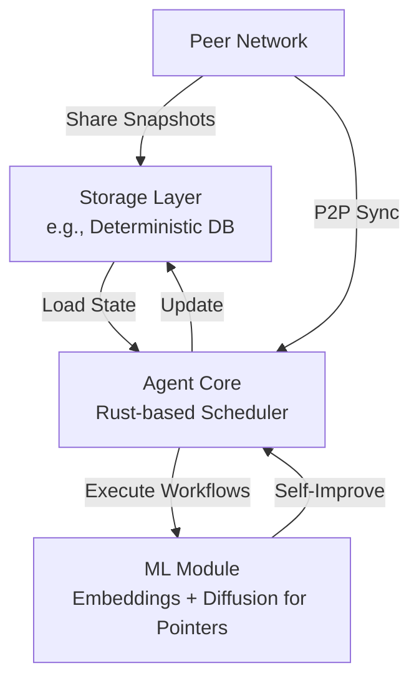

- 0.0 - Pointer To Interface: What VM/runtime are we using
- 0.1 - Inteface Codec: How are we encoding/decoding our messages to the vm
- 0.2 - Local Parameters:

## Creating My Own Embeddings

### Describing The Scenario And Returning The Result

"we are on our X step of our task T. We expect Y. W have gotten Z."

- a. get raw X,T,& Y from process
- b. perform actions to get specific,accurate,precise X,T,& Y.
- c. perfoms actions to get Z.

#### Step X

### Cnardium Storage X Gray_Scott Diffusion

## Goal: Trigger Cnardium Storage Snapshots To Occur On High Fidelity Buffer Fill

- Storage Keys are deterministcally filled into 4K image buffer (3840 x 2160).

### i24 as 24 bit-true-color storage keys

This allows us to store a storage key as a specific color value. We Know this is a range from  [-8,388,608, 8,388,607]
