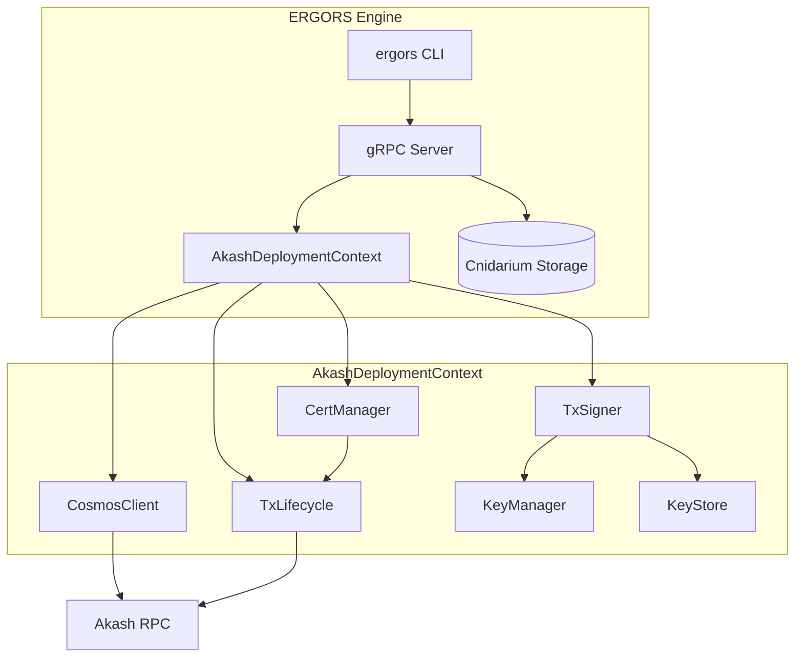
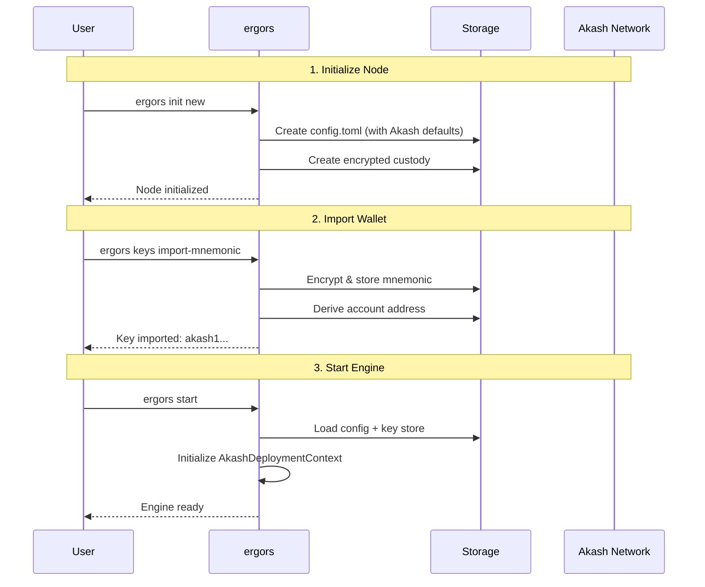
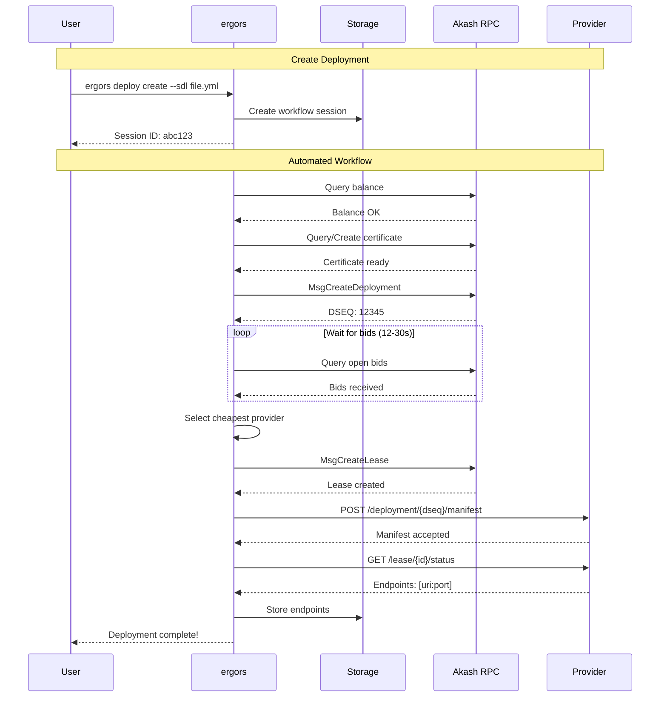
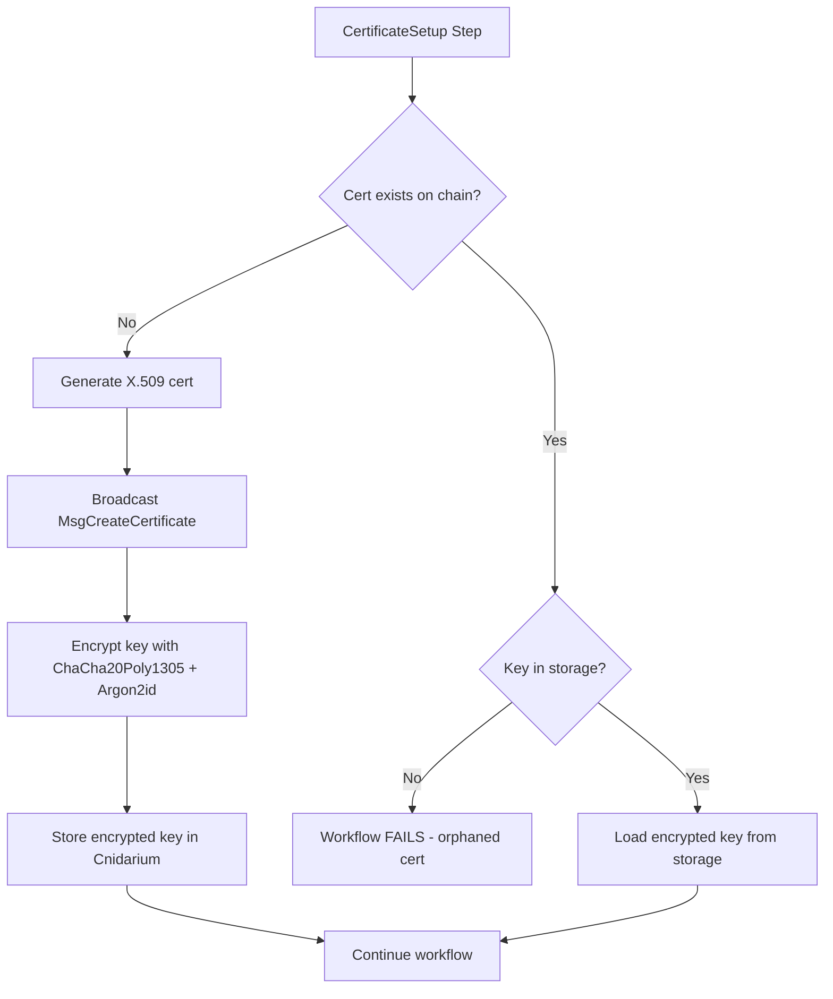
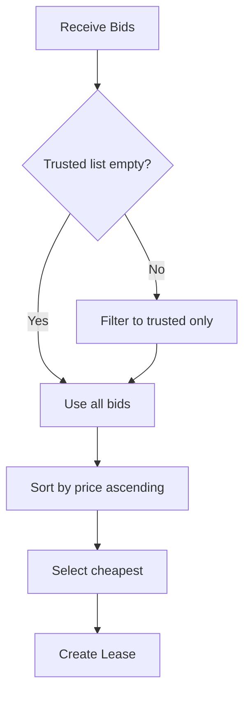
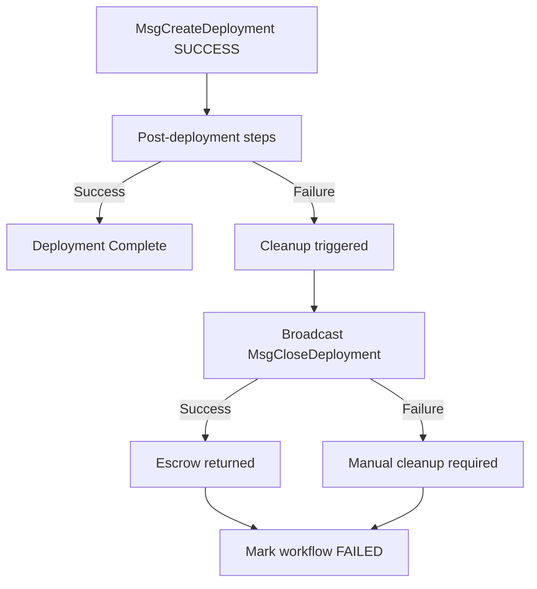
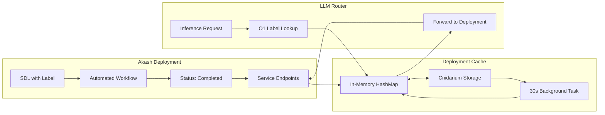

# Akash Network Deployment Specification

Automated deployment of compute resources to Akash Network via ERGORS engine.

## Architecture Overview



## Setup Sequence



### Setup Commands

| Step | Command | Description |
|------|---------|-------------|
| 1 | `ergors init new` | Initialize node with custody, config, and Akash mainnet defaults |
| 2 | `ergors keys import-mnemonic --phrase "..." --label "Main" --make-default` | Import funded Akash wallet |
| 3 | `ergors keys list` | Verify key imported correctly |
| 4 | `ergors start` | Start engine (initializes Akash context) |

### Configuration

Default Akash config in `~/.ergors/config.toml`:

```toml
[akash]
rpc_endpoint = "https://rpc-akash.ecostake.com:443"
grpc_endpoint = "https://grpc-akash.ecostake.com:443"
rest_endpoint = "https://rest-akash.ecostake.com"
chain_id = "akashnet-2"
gas_prices = "0.025uakt"
gas_adjustment = 1.3
default_key_name = "default"
```

| Config Key | Description | Default |
|------------|-------------|---------|
| `rpc_endpoint` | Tendermint RPC for tx broadcast | ecostake |
| `rest_endpoint` | LCD REST API for queries | ecostake |
| `chain_id` | Akash chain identifier | akashnet-2 |
| `gas_prices` | Gas price per unit | 0.025uakt |
| `default_key_name` | Default signing key | default |

## Deployment Workflow



### Workflow Steps

| Step | Name | Action | Failure Mode |
|------|------|--------|--------------|
| 1 | KeySelection | Validate signing key exists | "Key not found" |
| 2 | BalanceCheck | Verify balance >= min_balance | "Insufficient balance" |
| 3 | CertificateSetup | Get or create Akash mTLS cert (with key persistence) | "Certificate creation failed" |
| 4 | DeploymentCreate | Broadcast MsgCreateDeployment | "Deployment tx failed" |
| 5 | BidWait | Poll for provider bids (12-30s) | "No bids received" |
| 6 | ProviderSelection | Select cheapest (or from trusted list) | "No matching providers" |
| 7 | LeaseCreate | Broadcast MsgCreateLease | "Lease creation failed" |
| 8 | ManifestSend | POST manifest to provider (mTLS with stored cert key) | "Manifest send failed" |
| 9 | EndpointRetrieval | Query service endpoints | "Endpoints unavailable" |
| 10 | Complete | Store endpoints, mark complete | - |

### Deploy Commands

| Command | Description |
|---------|-------------|
| `ergors deploy create --sdl <path>` | Create and run automated deployment |
| `ergors deploy create --sdl <path> --interactive-bid` | Manual provider selection |
| `ergors deploy list` | List all deployment sessions |
| `ergors deploy get <session-id>` | Get deployment details |
| `ergors deploy info <session-id>` | Get comprehensive deployment info (unified view) |
| `ergors deploy status <session-id>` | Get lease status and endpoints |
| `ergors deploy endpoints <session-id>` | Get service endpoints |
| `ergors deploy bids <session-id>` | Query available provider bids |
| `ergors deploy select <session-id> <bid-id>` | Select provider by bid number |
| `ergors deploy close-lease <session-id>` | Close lease (keeps deployment) |
| `ergors deploy close-deployment <session-id>` | Close deployment and release all funds |
| `ergors deploy update-deployment <session-id> --sdl <path>` | Update deployment with new SDL |
| `ergors deploy topup-escrow <session-id> <amount>` | Top up escrow balance |

### Deploy Options

| Option | Description | Default |
|--------|-------------|---------|
| `--sdl <path>` | Path to SDL YAML file | required |
| `--label <label>` | User-friendly label (unique across active deployments) | - |
| `--key-name <name>` | Signing key name | `default` |
| `--account-index <n>` | HD derivation index | `0` |
| `--min-balance <uakt>` | Minimum required balance | `5000000` |
| `--interactive-bid` | Prompt for provider selection | `false` |
| `--node <url>` | Override RPC endpoint | config |
| `--chain-id <id>` | Override chain ID | config |

### Label-Based Access

Deployments can be created with user-friendly labels instead of session IDs:

```bash
# Create deployment with label
ergors deploy create --sdl qwen.yml --label qwen-inference --auto

# Access by label
ergors deploy info qwen-inference
ergors deploy endpoints qwen-inference
```

**Label Constraints:**
- Must be unique across active deployments (collision check at creation)
- Becomes inactive when deployment completes/fails
- O(1) storage lookups via index: `akash_labels/{label} → session_id`
- Active labels tracked separately: `akash_active_labels/{label} → session_id`

## SDL Format

Service Definition Language for Akash deployments.

### Minimal SDL

```yaml
version: "2.0"
services:
  web:
    image: nginx:latest
    expose:
      - port: 80
        as: 80
        to:
          - global: true
profiles:
  compute:
    web:
      resources:
        cpu:
          units: 1
        memory:
          size: 512Mi
        storage:
          - size: 1Gi
  placement:
    dcloud:
      pricing:
        web:
          denom: uakt
          amount: 10000
deployment:
  web:
    dcloud:
      profile: web
      count: 1
```

### GPU SDL (Embedding Model)

```yaml
version: "2.0"
services:
  sglang:
    image: lmsysorg/sglang:dev-cu13
    expose:
      - port: 8000
        as: 8000
        to:
          - global: true
    command: ["bash", "-c"]
    args:
      - >-
        python3 -m sglang.launch_server
        --model-path Qwen/Qwen3-VL-Embedding-8B
        --tensor-parallel-size 2
        --host 0.0.0.0 --port 8000
        --is-embedding --trust-remote-code
    params:
      storage:
        shm:
          mount: /dev/shm
        data:
          mount: /root/.cache
          readOnly: false
profiles:
  compute:
    sglang:
      resources:
        cpu:
          units: 32
        memory:
          size: 64Gi
        storage:
          - size: 50Gi
          - name: data
            size: 300Gi
            attributes:
              persistent: true
              class: beta3
          - name: shm
            size: 10Gi
            attributes:
              class: ram
              persistent: false
        gpu:
          units: 2
          attributes:
            vendor:
              nvidia:
                - model: h100
                  ram: 80Gi
                - model: a100
                  ram: 40Gi
  placement:
    dcloud:
      pricing:
        sglang:
          denom: uakt
          amount: 1000000
deployment:
  sglang:
    dcloud:
      profile: sglang
      count: 1
```

## Certificate Management

Akash requires mTLS certificates for provider communication. Certificates are persisted in Cnidarium storage with encrypted private keys.

### Certificate Lifecycle



### Storage Keys

| Key Pattern | Description |
|-------------|-------------|
| `akash_cert_keys/{owner_address}` | Encrypted certificate private key |
| `akash_provider_info/{provider_address}` | Cached provider metadata |

### Certificate Commands

| Command | Description |
|---------|-------------|
| `ergors deploy cert create` | Create new Akash certificate for default key |
| `ergors deploy cert create --key-name <name>` | Create certificate for specific key |
| `ergors deploy cert revoke` | Revoke current certificate |
| `ergors deploy cert revoke --serial <serial>` | Revoke certificate by serial number |
| `ergors deploy cert show` | Show current certificate info |

### Certificate Storage Format

Encrypted private keys use the same encryption as the key store:
- **Cipher**: ChaCha20Poly1305
- **KDF**: Argon2id (memory: 64MB, iterations: 3, parallelism: 4)
- **Key derivation**: From custody password

### Revocation

When revoking a certificate:
1. Broadcast `MsgRevokeCertificate` to chain
2. Delete encrypted key from Cnidarium storage
3. Any active deployments using this cert will fail mTLS handshakes

## Provider Info Caching

Provider metadata is cached locally for human-readable bid display and O(1) lookups.

### Cached Information

```rust
pub struct CachedProviderInfo {
    pub address: String,      // akash1...
    pub host_uri: String,     // https://provider.domain.com:8443
    pub email: String,
    pub website: String,
    pub attributes: Vec<(String, String)>,  // capability tags
    pub cached_at: i64,       // unix timestamp
}
```

### Cache Behavior

| Event | Action |
|-------|--------|
| Bid received | Check cache, query chain if miss, cache result |
| Provider query | Return cached if < 24h old, refresh otherwise |
| Manual refresh | `ergors deploy provider-info <address> --refresh` |

### Bid Display

Bids show human-readable provider names:

```
Available Bids for session abc123:
╔════╦════════════════════════╦════════════════════╦═══════════════╗
║ #  ║ Provider               ║ Name               ║ Price         ║
╠════╬════════════════════════╬════════════════════╬═══════════════╣
║ 1  ║ akash1h4h33c8rv...     ║ Overclock Labs     ║ 0.025 AKT/blk ║
║ 2  ║ akash1u5cdg7k3g...     ║ d3akash            ║ 0.028 AKT/blk ║
║ 3  ║ akash1kqzpqqhm3...     ║ leet.haus          ║ 0.030 AKT/blk ║
╚════╩════════════════════════╩════════════════════╩═══════════════╝
```

### Provider Info Commands

| Command | Description |
|---------|-------------|
| `ergors deploy provider-info <address>` | Show cached provider info |
| `ergors deploy provider-info <address> --refresh` | Force refresh from chain |

## Provider Management

### Trusted Providers

Pre-configured providers with verified reputation:

| Name | Address | Specialty |
|------|---------|-----------|
| d3akash | `akash1u5cdg7k3gl43mukca4aeultuz8x2j68mgwn28e` | General |
| overclock | `akash1h4h33c8rv8e084el7e74f7pktz27pmxxt8nl9q` | GPU |
| palmito | `akash15ksejj7g4su7ljufsg0a8eglvkje94z8qsh68a` | General |
| leet.haus | `akash1kqzpqqhm39umt06wu8m4hx63v5hefhrfmjf9dj` | GPU |
| akashgpu | `akash1ut3m97h62tty06qdq9lds85r34dxe3snjj0xfe` | GPU |

### Provider Commands

| Command | Description |
|---------|-------------|
| `ergors deploy trusted-providers` | List trusted providers |
| `ergors deploy add-provider <addr> --label <name>` | Add trusted provider |
| `ergors deploy remove-provider <addr>` | Remove trusted provider |
| `ergors deploy bids <session-id>` | Query available bids |
| `ergors deploy select <session-id> --provider <addr>` | Manually select provider |

### Provider Selection Logic



## Deployment Management

### Unified Info View

Get comprehensive deployment information in a single command:

```bash
ergors deploy info <session-id>

# JSON output
ergors deploy info <session-id> --json
```

**Output:**

```
╔══════════════════════════════════════════════════════════════╗
║             Akash Deployment Information                     ║
╠══════════════════════════════════════════════════════════════╣
║ Session ID: abc123                                           ║
║ Status:     completed                                        ║
║ Step:       Complete                                         ║
╠══════════════════════════════════════════════════════════════╣
║ Account                                                      ║
╠══════════════════════════════════════════════════════════════╣
║ Address:    akash1abc...                                     ║
║ Key:        default                                          ║
║ Chain:      akashnet-2                                       ║
╠══════════════════════════════════════════════════════════════╣
║ Deployment                                                   ║
╠══════════════════════════════════════════════════════════════╣
║ DSEQ:       12345                                            ║
║ Provider:   akash1provider...                                ║
╠══════════════════════════════════════════════════════════════╣
║ Lease                                                        ║
╠══════════════════════════════════════════════════════════════╣
║ DSEQ:       12345                                            ║
║ GSEQ:       1                                                ║
║ OSEQ:       1                                                ║
║ Provider:   akash1provider...                                ║
╠══════════════════════════════════════════════════════════════╣
║ Service Endpoints                                            ║
╠══════════════════════════════════════════════════════════════╣
║ Service:    sglang                                           ║
║   URI:      xyz.provider.akash.network:8000                  ║
║   Port:     8000:8000 (tcp)                                  ║
╚══════════════════════════════════════════════════════════════╝
```

### Closing Deployments

Two options for closing:

**Close Lease (keeps deployment):**

```bash
ergors deploy close-lease <session-id>
```

- Closes the active lease with provider
- Deployment remains on-chain
- Can create new lease later

**Close Deployment (complete shutdown):**

```bash
ergors deploy close-deployment <session-id>
```

- Closes deployment on-chain
- Automatically closes any active leases
- Releases all escrow funds
- Permanent closure

### Updating Deployments

Update deployment resources with new SDL:

```bash
ergors deploy update-deployment <session-id> --sdl new-config.yml
```

**Process:**

1. Reads new SDL file
2. Hashes SDL with SHA256
3. Broadcasts `MsgUpdateDeployment` to chain
4. Updates deployment specifications

**Note:** After updating, you may need to send a new manifest to the provider.

### Escrow Management

**Top Up Escrow:**

```bash
# Add 10 AKT (10,000,000 uakt)
ergors deploy topup-escrow <session-id> 10000000
```

**Check Escrow Balance:**

Escrow balance is shown in the info command or can be queried via:

```bash
ergors deploy info <session-id>
```

**Escrow Details:**

- Balance tracked per deployment (owner/dseq pair)
- Automatically deducted for lease payments
- Can be topped up at any time
- Released when deployment closes

## Monitoring

### Status Tracking

```bash
# Single check
ergors deploy status <session-id>

# Continuous monitoring
ergors deploy status <session-id> --follow
```

**Output:**

```
Lease Status: active
  Owner:    akash1abc...
  DSEQ:     12345
  Provider: akash1provider...
  Balance:  4500000 uakt remaining
  Endpoints:
    sglang -> xyz.provider.akash.network:8000
```

### Query Balance

```bash
ergors deploy query-balance <address>
```

## Automatic Cleanup on Failure

After `MsgCreateDeployment` succeeds, if any subsequent step fails, the workflow automatically broadcasts `MsgCloseDeployment` to:

1. **Recover escrow deposit** - Initial deposit is returned to wallet
2. **Prevent hanging deployments** - No orphaned deployments on-chain
3. **Clean state** - Workflow marked as failed with error message

### Cleanup Sequence



### Steps Covered by Cleanup

| Step | On Failure | Cleanup Action |
|------|------------|----------------|
| BidWait | No bids received | Close deployment |
| ProviderSelection | No matching providers | Close deployment |
| LeaseCreate | Tx failed | Close deployment |
| ManifestSend | mTLS or provider error | Close deployment |
| EndpointRetrieval | Endpoints unavailable | Close deployment |

### Manual Cleanup

If automatic cleanup fails, manually close:

```bash
ergors deploy close-deployment <session-id>
```

## Error Handling

| Error | Cause | Resolution |
|-------|-------|------------|
| `Akash deployment context not initialized` | Missing config or keys | Run `ergors keys import-mnemonic` |
| `Insufficient balance` | Account < min_balance | Fund account with AKT |
| `No bids received` | No providers available | Increase max price in SDL |
| `Key not found` | Key name doesn't exist | Check `ergors keys list` |
| `Certificate creation failed` | Network or key issue | Restart engine |
| `No encrypted certificate private key` | Cert exists on chain but key not in storage | Revoke cert and create new one |
| `Manifest send failed` | Provider unreachable or mTLS failure | Check cert validity, select different provider |
| `Certificate revocation failed` | Network or invalid serial | Check `ergors deploy cert show` for correct serial |
| `Failed to close deployment during cleanup` | Network error during cleanup | Manual cleanup: `ergors deploy close-deployment <session>` |

## File Reference

| File | Purpose |
|------|---------|
| `packages/ergors/src/lib.rs` | `AkashDeploymentContext` definition |
| `packages/ergors/src/server.rs` | Context initialization on startup |
| `packages/ergors/src/deploy/signer.rs` | Transaction signing with layer-climb |
| `packages/ergors/src/deploy/akash.rs` | Transaction broadcasting helpers |
| `packages/ergors/src/deploy/certificate.rs` | Certificate management (with key persistence) |
| `packages/ergors/src/deploy/automated.rs` | Workflow orchestration, provider info caching |
| `packages/ergors/src/deploy/deployment_builder.rs` | Message builders (create, close, update, escrow) |
| `packages/ergors/src/deploy/cosmos_client.rs` | Chain queries (balance, bids, leases, escrow) |
| `packages/ergors/src/deploy/manifest.rs` | Manifest generation and provider communication |
| `packages/ergors/src/grpc/management.rs` | gRPC handlers for deployment management |
| `packages/ergors/src/commands/deploy.rs` | CLI implementation (including cert commands) |
| `packages/ergors/src/client/mod.rs` | gRPC client methods |
| `packages/ergors/src/storage.rs` | Cnidarium storage for workflows, cert keys, provider info |
| `proto/ergors/orch/v1/orch.proto` | Deployment workflow proto definitions |
| `proto/ergors/management/v1/management.proto` | Management service proto definitions |

### Storage Keys Reference

| Prefix | Key Pattern | Value |
|--------|-------------|-------|
| `akash_workflows` | `akash_workflows/{session_id}` | Serialized workflow state |
| `akash_labels` | `akash_labels/{label}` | Session ID (historical) |
| `akash_active_labels` | `akash_active_labels/{label}` | Session ID (active only) |
| `akash_cert_keys` | `akash_cert_keys/{owner_address}` | Encrypted certificate private key |
| `akash_provider_info` | `akash_provider_info/{provider_address}` | Cached provider metadata |

## Complete Lifecycle Examples

### Example 1: Deploy, Monitor, and Close

```bash
# 1. Create deployment
ergors deploy create --sdl sdls/embeddings/qwen.yml
# Output: Session ID: abc123

# 2. View comprehensive info
ergors deploy info abc123

# 3. Get service endpoints
ergors deploy endpoints abc123

# 4. Access your service
curl http://xyz.provider.akash.network:8000/health

# 5. Monitor status
ergors deploy status abc123

# 6. Close when done
ergors deploy close-deployment abc123
```

### Example 2: Deploy, Update, and Scale

```bash
# 1. Initial deployment (2 CPU, 4Gi RAM)
ergors deploy create --sdl sdls/api-small.yml
# Output: Session ID: def456

# 2. Check info
ergors deploy info def456

# 3. Update to larger resources (4 CPU, 8Gi RAM)
ergors deploy update-deployment def456 --sdl sdls/api-large.yml

# 4. Verify update
ergors deploy info def456
```

### Example 3: Manage Escrow Balance

```bash
# 1. Deploy with initial balance
ergors deploy create --sdl sdls/long-running.yml
# Output: Session ID: ghi789

# 2. Check escrow balance
ergors deploy info ghi789
# Shows: Balance remaining

# 3. Top up before running out
ergors deploy topup-escrow ghi789 5000000

# 4. Verify balance increased
ergors deploy info ghi789
```

### Example 4: Manual Provider Selection

```bash
# 1. Create deployment (auto workflow)
ergors deploy create --sdl sdls/gpu-task.yml
# Output: Session ID: jkl012

# 2. Query available bids
ergors deploy bids jkl012
# Output:
#   [1] akash1provider1... | 0.025 AKT/block
#   [2] akash1provider2... | 0.030 AKT/block
#   [3] akash1provider3... | 0.028 AKT/block

# 3. Select specific provider
ergors deploy select jkl012 2

# 4. Continue workflow
ergors deploy run jkl012
```

### Example 5: Troubleshooting Failed Deployment

```bash
# 1. Deployment fails during bid wait
ergors deploy create --sdl sdls/high-gpu.yml
# Output: Session ID: mno345

# 2. Check detailed info
ergors deploy info mno345
# Shows: Last Error: "No bids received"

# 3. Query bids directly
ergors deploy bids mno345
# Output: No bids available

# 4. Update SDL with lower price
ergors deploy update-deployment mno345 --sdl sdls/high-gpu-adjusted.yml

# 5. Retry workflow
ergors deploy run mno345
```

## Deployment → Inference Integration

ERGORS automatically integrates completed Akash deployments into the LLM routing system, enabling deployments to be used as inference endpoints.

### Architecture



### How It Works

1. **Deployment Creation with Label:**
   ```bash
   ergors deploy create \
     --sdl sdls/embeddings/qwen.yml \
     --label qwen-inference \
     --auto
   ```

2. **Automatic Cache Registration:**
   - When deployment status → `Completed` (step 10)
   - gRPC handler calls `deployment_cache().add_deployment()`
   - Label → endpoint mapping cached in memory (O(1) lookup)
   - Backed by Cnidarium for persistence

3. **Inference Routing:**
   ```bash
   curl http://localhost:8080/v1/chat/completions \
     -H "Content-Type: application/json" \
     -d '{"model": "qwen-inference", "messages": [...]}'
   ```

4. **Routing Priority:**
   - **First**: Check deployment cache by label
   - **Second**: Check configured providers (OpenAI, Anthropic, etc.)
   - **Fallback**: Error if no match found

### Cache Management

| Event | Action |
|-------|--------|
| Deployment completes | Add to cache with label → endpoint mapping |
| Close lease/deployment | Remove from cache |
| Background refresh (30s) | Sync cache with Cnidarium storage |
| Server restart | Rebuild cache from storage on startup |

### Storage Keys

```
akash_labels/{label} → session_id          # Historical (all deployments)
akash_active_labels/{label} → session_id   # Active only (collision check)
akash_workflows/{session_id} → workflow    # Full workflow data
```

### OpenAI Compatibility

Deployments must expose OpenAI-compatible endpoints:

| Endpoint | Expected Format |
|----------|----------------|
| `/v1/chat/completions` | OpenAI ChatCompletion API |
| `/v1/embeddings` | OpenAI Embeddings API |

**Response Format:**

```json
{
  "choices": [
    {
      "message": {
        "content": "Hello! How can I help you today?"
      }
    }
  ],
  "usage": {
    "prompt_tokens": 12,
    "completion_tokens": 45,
    "total_tokens": 57
  }
}
```

Token usage is automatically extracted and stored in `PromptResponse.tokens_used`.

### Example Workflow

```bash
# 1. Deploy inference service
ergors deploy create \
  --sdl sdls/embeddings/qwen.yml \
  --label qwen-inference \
  --auto

# 2. Wait for completion (~2-5 minutes)
ergors deploy info qwen-inference
# Status: completed
# Endpoints: https://provider.akash.network:8443

# 3. Use as model in inference (automatic routing)
curl http://localhost:8080/v1/chat/completions \
  -H "Content-Type: application/json" \
  -d '{
    "model": "qwen-inference",
    "messages": [{"role": "user", "content": "Explain quantum computing"}]
  }'

# 4. List all available models (includes active deployments)
curl http://localhost:8080/v1/models
# {
#   "object": "list",
#   "data": [
#     {"id": "gpt-4", "owned_by": "openai"},
#     {"id": "claude-3-5-sonnet-20241022", "owned_by": "anthropic"},
#     {"id": "qwen-inference", "owned_by": "akash-deployment"}
#   ]
# }

# 5. Close deployment (removes from cache automatically)
ergors deploy close-deployment qwen-inference
```

### File Reference

| File | Purpose |
|------|---------|
| `packages/ho-std/src/llm/deployment_cache.rs` | In-memory O(1) cache for deployments |
| `packages/ho-std/src/llm/router.rs` | LLM router with deployment-first routing |
| `packages/ergors/src/grpc/management.rs` | Cache add/remove lifecycle hooks |
| `packages/ergors/src/storage.rs` | Label storage indices and collision checks |
| `packages/ergors/src/server.rs` | Background cache refresh task (30s) |
| `packages/ergors/src/proxy/endpoints.rs` | `/v1/models` endpoint handler |

### Features

- **Zero-config integration**: Deployments auto-register on completion
- **O(1) routing**: In-memory HashMap lookup by label
- **Token tracking**: Automatic extraction from OpenAI responses
- **Lifecycle sync**: Auto-add on complete, auto-remove on close
- **Persistence**: Cnidarium-backed for restart recovery
- **Collision prevention**: Label uniqueness enforced at creation time

## Quick Reference

```bash
# Full setup → deployment → inference flow
ergors init new
ergors keys import-mnemonic --phrase "..." --label "Akash" --make-default
ergors start &
ergors deploy create --sdl sdls/embeddings/qwen.yml --label qwen-inference --auto
ergors deploy info qwen-inference

# Use deployment as inference endpoint
curl http://localhost:8080/v1/chat/completions \
  -d '{"model": "qwen-inference", "messages": [...]}'

# Management operations
ergors deploy endpoints qwen-inference
ergors deploy topup-escrow qwen-inference 10000000
ergors deploy update-deployment qwen-inference --sdl new.yml
ergors deploy close-deployment qwen-inference
```
