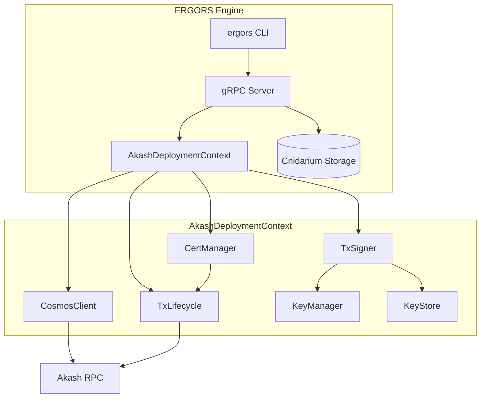
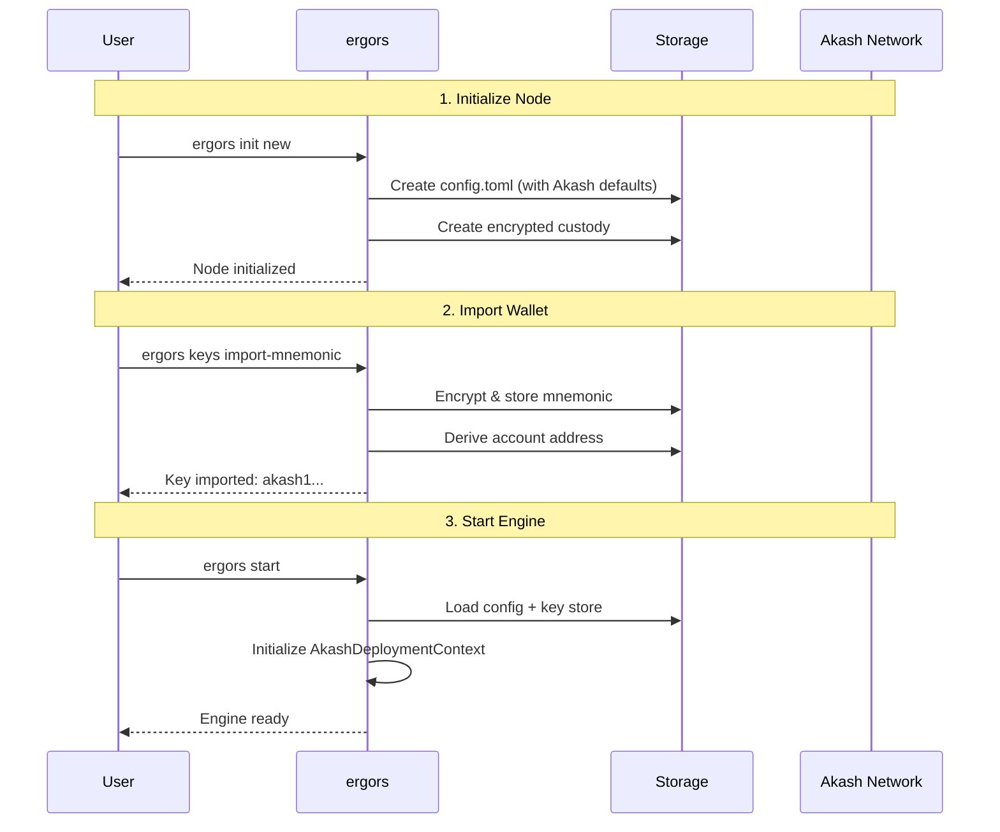
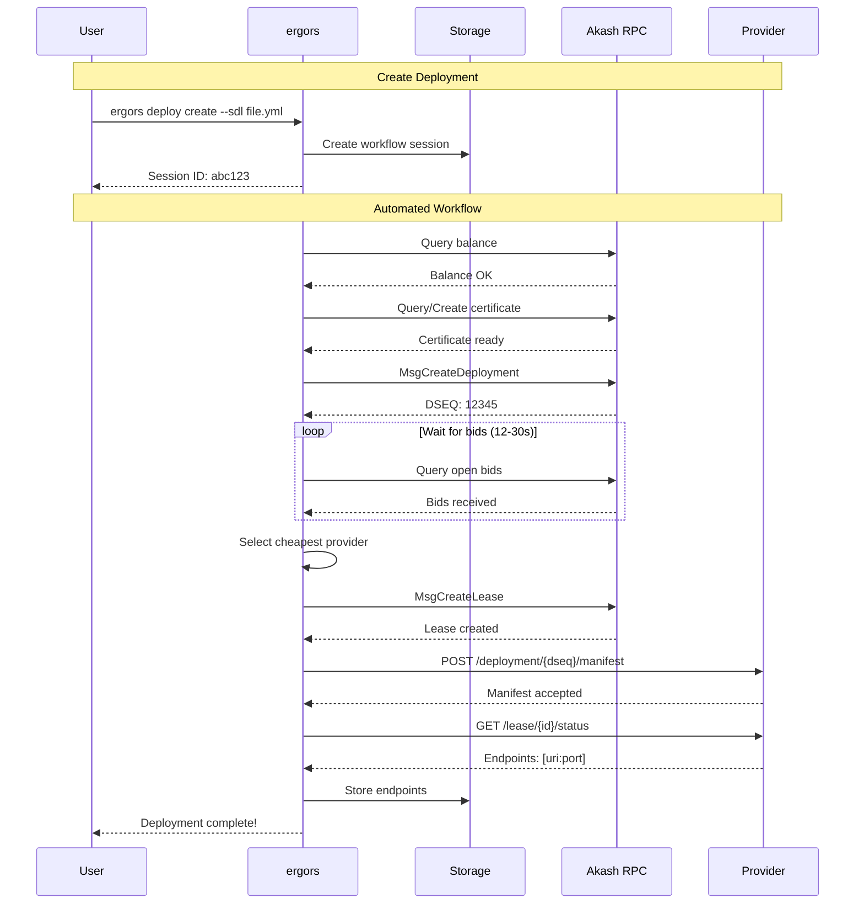
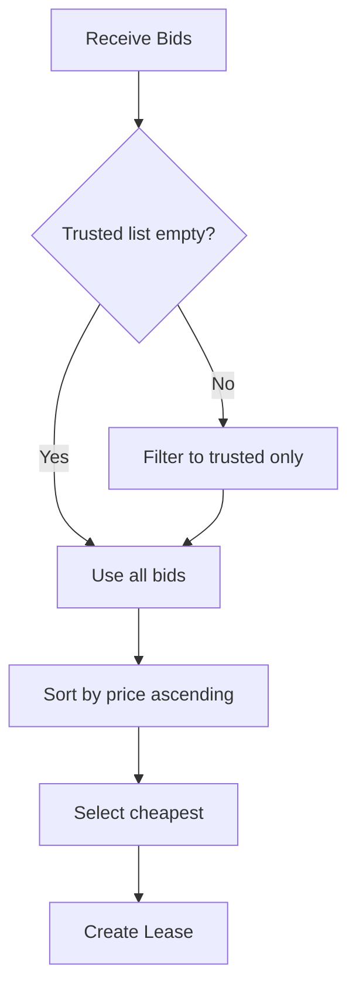

# Akash Network Deployment Specification

Automated deployment of compute resources to Akash Network via ERGORS engine.

## Architecture Overview



## Setup Sequence



### Setup Commands

| Step | Command | Description |
|------|---------|-------------|
| 1 | `ergors init new` | Initialize node with custody, config, and Akash mainnet defaults |
| 2 | `ergors keys import-mnemonic --phrase "..." --label "Main" --make-default` | Import funded Akash wallet |
| 3 | `ergors keys list` | Verify key imported correctly |
| 4 | `ergors start` | Start engine (initializes Akash context) |

### Configuration

Default Akash config in `~/.ergors/config.toml`:

```toml
[akash]
rpc_endpoint = "https://rpc-akash.ecostake.com:443"
grpc_endpoint = "https://grpc-akash.ecostake.com:443"
rest_endpoint = "https://rest-akash.ecostake.com"
chain_id = "akashnet-2"
gas_prices = "0.025uakt"
gas_adjustment = 1.3
default_key_name = "default"
```

| Config Key | Description | Default |
|------------|-------------|---------|
| `rpc_endpoint` | Tendermint RPC for tx broadcast | ecostake |
| `rest_endpoint` | LCD REST API for queries | ecostake |
| `chain_id` | Akash chain identifier | akashnet-2 |
| `gas_prices` | Gas price per unit | 0.025uakt |
| `default_key_name` | Default signing key | default |

## Deployment Workflow



### Workflow Steps

| Step | Name | Action | Failure Mode |
|------|------|--------|--------------|
| 1 | KeySelection | Validate signing key exists | "Key not found" |
| 2 | BalanceCheck | Verify balance >= min_balance | "Insufficient balance" |
| 3 | CertificateSetup | Get or create Akash mTLS cert | "Certificate creation failed" |
| 4 | DeploymentCreate | Broadcast MsgCreateDeployment | "Deployment tx failed" |
| 5 | BidWait | Poll for provider bids (12-30s) | "No bids received" |
| 6 | ProviderSelection | Select cheapest (or from trusted list) | "No matching providers" |
| 7 | LeaseCreate | Broadcast MsgCreateLease | "Lease creation failed" |
| 8 | ManifestSend | POST manifest to provider | "Manifest send failed" |
| 9 | EndpointRetrieval | Query service endpoints | "Endpoints unavailable" |
| 10 | Complete | Store endpoints, mark complete | - |

### Deploy Commands

| Command | Description |
|---------|-------------|
| `ergors deploy create --sdl <path>` | Create and run automated deployment |
| `ergors deploy create --sdl <path> --interactive-bid` | Manual provider selection |
| `ergors deploy list` | List all deployment sessions |
| `ergors deploy get <session-id>` | Get deployment details |
| `ergors deploy status <session-id>` | Get lease status and endpoints |
| `ergors deploy close-lease <session-id>` | Close deployment and release funds |

### Deploy Options

| Option | Description | Default |
|--------|-------------|---------|
| `--sdl <path>` | Path to SDL YAML file | required |
| `--key-name <name>` | Signing key name | `default` |
| `--account-index <n>` | HD derivation index | `0` |
| `--min-balance <uakt>` | Minimum required balance | `5000000` |
| `--interactive-bid` | Prompt for provider selection | `false` |
| `--node <url>` | Override RPC endpoint | config |
| `--chain-id <id>` | Override chain ID | config |

## SDL Format

Service Definition Language for Akash deployments.

### Minimal SDL

```yaml
version: "2.0"
services:
  web:
    image: nginx:latest
    expose:
      - port: 80
        as: 80
        to:
          - global: true
profiles:
  compute:
    web:
      resources:
        cpu:
          units: 1
        memory:
          size: 512Mi
        storage:
          - size: 1Gi
  placement:
    dcloud:
      pricing:
        web:
          denom: uakt
          amount: 10000
deployment:
  web:
    dcloud:
      profile: web
      count: 1
```

### GPU SDL (Embedding Model)

```yaml
version: "2.0"
services:
  sglang:
    image: lmsysorg/sglang:dev-cu13
    expose:
      - port: 8000
        as: 8000
        to:
          - global: true
    command: ["bash", "-c"]
    args:
      - >-
        python3 -m sglang.launch_server
        --model-path Qwen/Qwen3-VL-Embedding-8B
        --tensor-parallel-size 2
        --host 0.0.0.0 --port 8000
        --is-embedding --trust-remote-code
    params:
      storage:
        shm:
          mount: /dev/shm
        data:
          mount: /root/.cache
          readOnly: false
profiles:
  compute:
    sglang:
      resources:
        cpu:
          units: 32
        memory:
          size: 64Gi
        storage:
          - size: 50Gi
          - name: data
            size: 300Gi
            attributes:
              persistent: true
              class: beta3
          - name: shm
            size: 10Gi
            attributes:
              class: ram
              persistent: false
        gpu:
          units: 2
          attributes:
            vendor:
              nvidia:
                - model: h100
                  ram: 80Gi
                - model: a100
                  ram: 40Gi
  placement:
    dcloud:
      pricing:
        sglang:
          denom: uakt
          amount: 1000000
deployment:
  sglang:
    dcloud:
      profile: sglang
      count: 1
```

## Provider Management

### Trusted Providers

Pre-configured providers with verified reputation:

| Name | Address | Specialty |
|------|---------|-----------|
| d3akash | `akash1u5cdg7k3gl43mukca4aeultuz8x2j68mgwn28e` | General |
| overclock | `akash1h4h33c8rv8e084el7e74f7pktz27pmxxt8nl9q` | GPU |
| palmito | `akash15ksejj7g4su7ljufsg0a8eglvkje94z8qsh68a` | General |
| leet.haus | `akash1kqzpqqhm39umt06wu8m4hx63v5hefhrfmjf9dj` | GPU |
| akashgpu | `akash1ut3m97h62tty06qdq9lds85r34dxe3snjj0xfe` | GPU |

### Provider Commands

| Command | Description |
|---------|-------------|
| `ergors deploy trusted-providers` | List trusted providers |
| `ergors deploy add-provider <addr> --label <name>` | Add trusted provider |
| `ergors deploy remove-provider <addr>` | Remove trusted provider |
| `ergors deploy bids <session-id>` | Query available bids |
| `ergors deploy select <session-id> --provider <addr>` | Manually select provider |

### Provider Selection Logic



## Monitoring

### Status Tracking

```bash
# Single check
ergors deploy status <session-id>

# Continuous monitoring
ergors deploy status <session-id> --follow
```

**Output:**

```
Lease Status: active
  Owner:    akash1abc...
  DSEQ:     12345
  Provider: akash1provider...
  Balance:  4500000 uakt remaining
  Endpoints:
    sglang -> xyz.provider.akash.network:8000
```

### Query Balance

```bash
ergors deploy query-balance <address>
```

## Error Handling

| Error | Cause | Resolution |
|-------|-------|------------|
| `Akash deployment context not initialized` | Missing config or keys | Run `ergors keys import-mnemonic` |
| `Insufficient balance` | Account < min_balance | Fund account with AKT |
| `No bids received` | No providers available | Increase max price in SDL |
| `Key not found` | Key name doesn't exist | Check `ergors keys list` |
| `Certificate creation failed` | Network or key issue | Restart engine |
| `Manifest send failed` | Provider unreachable | Select different provider |

## File Reference

| File | Purpose |
|------|---------|
| `packages/cw-ho/src/lib.rs` | `AkashDeploymentContext` definition |
| `packages/cw-ho/src/server.rs` | Context initialization on startup |
| `packages/cw-ho/src/deploy/signer.rs` | Transaction signing |
| `packages/cw-ho/src/deploy/tx_lifecycle.rs` | Broadcast and finality |
| `packages/cw-ho/src/deploy/certificate.rs` | Certificate management |
| `packages/cw-ho/src/deploy/automated.rs` | Workflow orchestration |
| `packages/cw-ho/src/deploy/cosmos_client.rs` | Chain queries |
| `packages/cw-ho/src/grpc/management.rs` | gRPC handlers |
| `packages/cw-ho/src/commands/deploy.rs` | CLI implementation |

## Quick Reference

```bash
# Full setup → deployment flow
ergors init new
ergors keys import-mnemonic --phrase "..." --label "Akash" --make-default
ergors start &
ergors deploy create --sdl sdls/embeddings/qwen.yml
ergors deploy status <session-id>
```
