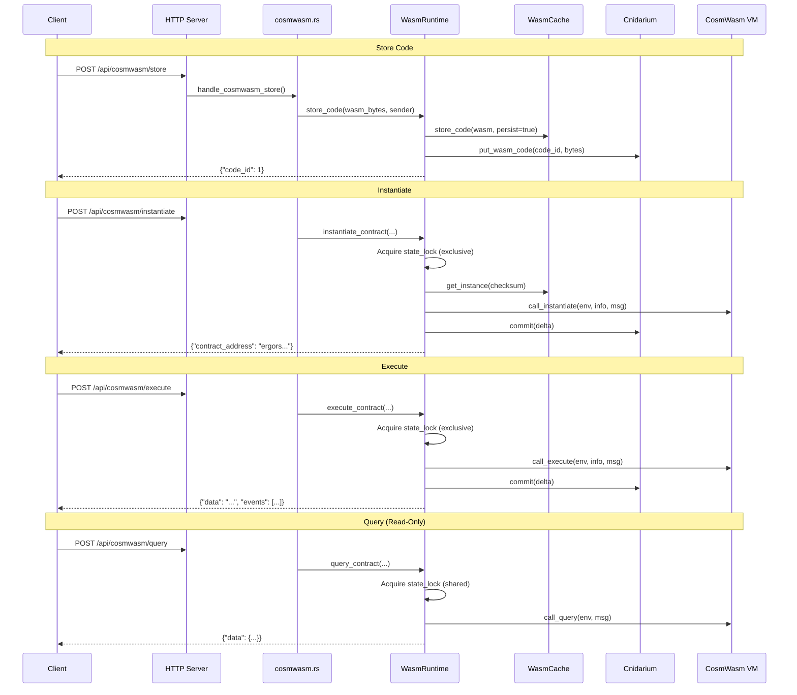
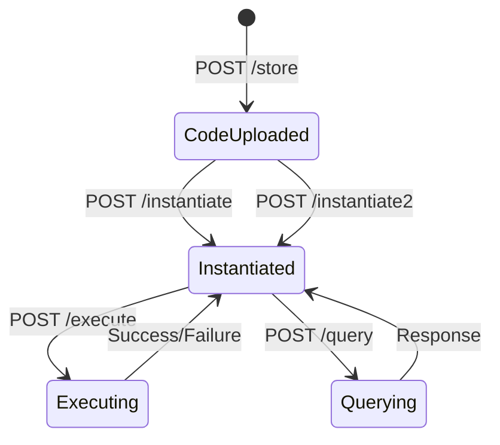
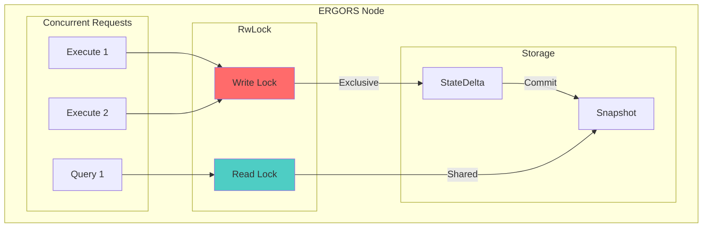

# CosmWasm VM Integration Specification

## Overview

ERGORS integrates CosmWasm VM to enable each node to instantiate and execute smart contracts as isolated "mini-chains". Each node maintains its own VM instance with node-wide state synchronization.

## Quick Reference

### HTTP API Endpoints

| Endpoint | Method | Purpose |
|----------|--------|---------|
| `/api/cosmwasm/store` | POST | Upload WASM bytecode |
| `/api/cosmwasm/instantiate` | POST | Create contract instance |
| `/api/cosmwasm/instantiate2` | POST | Create with predictable address (salt) |
| `/api/cosmwasm/execute` | POST | Execute contract method |
| `/api/cosmwasm/query` | POST | Query contract state (read-only) |

### CLI Commands

| Command | Purpose |
|---------|---------|
| `ergors sdl list` | List deployed SDL template contracts |
| `ergors sdl get-template <addr>` | Get SDL template from contract |
| `ergors sdl get-defaults <addr>` | Get variable defaults |
| `ergors sdl render <addr> --var K=V` | Render SDL with variables |

### Shell Wrappers (E2E)

```bash
ergors_cw_store <sender> <wasm_base64>
ergors_cw_instantiate <code_id> <sender> <label> <msg_json> [admin] [funds]
ergors_cw_instantiate2 <code_id> <sender> <label> <msg_json> <salt> [admin] [funds]
ergors_cw_execute <contract> <sender> <msg_json> [funds]
ergors_cw_query <contract> <query_json>
```

## Architecture

### VM Integration Flow



### Contract Lifecycle



### State Synchronization



**Guarantees:**
- All writes committed before subsequent reads
- Cross-contract queries see consistent state
- No stale reads within node
- Partial state preserved on failures (CosmWasm standard)

## Core Components

| Component | File | Purpose |
|-----------|------|---------|
| WasmRuntime | `packages/ho-std/src/wasm/runtime.rs` | Contract lifecycle (store, instantiate, execute, query) |
| CnidariumStorage | `packages/ho-std/src/wasm/backend.rs` | Thread-safe state access via StateDelta |
| WasmVmBackend | `packages/ho-std/src/wasm/backend.rs` | Address validation, crypto ops, querier |
| HTTP Handlers | `packages/ergors/src/cosmwasm.rs` | REST API endpoints |
| Contract Manager | `packages/ergors/src/contracts/manager.rs` | Named contract resolution, auto-deployment |

### Contract Address Generation

Deterministic addressing: `ergors{node_id}_{hash}`

```rust
fn generate_contract_address(code_id: u64, creator: &str, label: &str, node_id: &str) -> String {
    let hash = sha256(node_id || code_id || creator || label);
    format!("ergors{}_{}", node_id, hex::encode(&hash[..20]))
}
```

### Storage Structure

```
wasm/
├── code/{code_id}/bytecode, info, hash
├── contracts/{address}/info, state/{key}, code_id
└── config/next_code_id
```

### Gas Limits

| Operation | Default |
|-----------|---------|
| Instantiate | 100,000,000 |
| Execute | 50,000,000 |
| Query | 10,000,000 |
| Migrate | 75,000,000 |

## HTTP API

### Store Code

```http
POST /api/cosmwasm/store

{"sender": "akash1...", "wasm_byte_code": "<base64>"}

Response: {"code_id": 1, "sender": "akash1..."}
```

### Instantiate

```http
POST /api/cosmwasm/instantiate

{
  "code_id": 1,
  "sender": "akash1...",
  "admin": "akash1...",      // optional
  "label": "my-contract",
  "msg": {...},
  "funds": [{"denom": "uakt", "amount": "1000000"}]  // optional
}

Response: {"contract_address": "ergors...", "code_id": 1, "events": [...]}
```

### Instantiate2 (Predictable Address)

```http
POST /api/cosmwasm/instantiate2

{
  "code_id": 1,
  "sender": "akash1...",
  "label": "my-contract",
  "msg": {...},
  "salt": "<base64>",  // required
  "funds": []
}

Response: {"contract_address": "ergors...", "salt": "..."}
```

Address derivation: `hash(code_id || sender || salt || label)`

### Execute

```http
POST /api/cosmwasm/execute

{
  "contract": "ergors...",
  "sender": "akash1...",
  "msg": {"transfer": {"recipient": "akash1...", "amount": "1000"}},
  "funds": []
}

Response: {"contract": "...", "sender": "...", "data": "<base64>", "events": [...]}
```

### Query

```http
POST /api/cosmwasm/query

{"contract": "ergors...", "query": {"get_balance": {"address": "akash1..."}}}

Response: {"contract": "...", "data": {"balance": "1000"}}
// or for binary: {"contract": "...", "data_raw": "<base64>"}
```

### Error Format

```json
{
  "error": {
    "code": "WASM_ERROR|VALIDATION_ERROR|NOT_FOUND|UNAUTHORIZED|GAS_EXHAUSTED",
    "message": "Human-readable message"
  }
}
```

## Contract Deployment

### Coordinator Auto-Deployment

```
Startup → Is Coordinator? → Contract Exists? → No → Upload WASM + Instantiate
                                            → Yes → Skip
```

### Default Contracts

| Contract | Purpose |
|----------|---------|
| `identity_registry` | Node identity verification, key share tracking |
| `cw_sdl` | SDL template storage and rendering |

### Programmatic Deployment

```rust
let manager = ContractManager::new(storage, wasm_runtime, node_id);

if !manager.contract_exists("my-contract").await? {
    let code_id = manager.upload_contract(&wasm_bytes, "my-contract").await?;
    let address = manager.instantiate_contract(code_id, "my-contract", &init_msg).await?;
}
```

## Cross-Node Communication

Nodes can query/execute contracts on other nodes via P2P (Channel 4):

```
Node A ──ContractQuery──► Node B
       ◄─QueryResponse──
```

**Permission Model:**
- Queries: Read-only, allowed by default
- Executions: Require signature verification
- Admin ops: Only contract admin

## Configuration

```bash
COSMWASM_ENABLED=true
COSMWASM_CACHE_DIR=./data/wasm_cache
COSMWASM_MEMORY_LIMIT=33554432  # 32MB
```

```toml
[features]
cw = ["cosmwasm-vm", "cosmwasm-std"]
```

## Security

- **Resource Limits**: Gas metering, memory limits, code size validation
- **Isolation**: Contract state isolated per address, no filesystem access
- **Validation**: WASM bytecode validation, address format checks, permission verification

## File Locations

| Component | Path |
|-----------|------|
| HTTP Handlers | `packages/ergors/src/cosmwasm.rs` |
| Server Routes | `packages/ergors/src/server.rs` |
| WasmRuntime | `packages/ho-std/src/wasm/runtime.rs` |
| Storage Backend | `packages/ho-std/src/wasm/backend.rs` |
| State Extensions | `packages/ho-std/src/wasm/state_ext.rs` |
| Contract Manager | `packages/ergors/src/contracts/manager.rs` |
| SDL Manager | `packages/ergors/src/deploy/sdl.rs` |
| CLI Commands | `packages/ergors/src/commands/mod.rs` |
| E2E Wrappers | `scripts/e2e/lib/ergors.sh` |
| E2E Tests | `scripts/e2e/tests/contracts.sh` |

## Example: Deploy SDL Contract

```bash
# Store code
WASM_B64=$(base64 -i contracts/artifacts/cw_sdl.wasm)
RESULT=$(ergors_cw_store "akash1sender..." "$WASM_B64")
CODE_ID=$(echo "$RESULT" | jq -r '.code_id')

# Instantiate
INIT='{"sdl_template": "version: \"2.0\"...", "defaults": {"CPU": "2"}}'
RESULT=$(ergors_cw_instantiate "$CODE_ID" "akash1sender..." "sdl-v1" "$INIT")
CONTRACT=$(echo "$RESULT" | jq -r '.contract_address')

# Query template
ergors_cw_query "$CONTRACT" '{"get_template": {}}'

# Render with variables
ergors_cw_query "$CONTRACT" '{"render_sdl": {"variables": {"CPU": "4"}}}'
```
