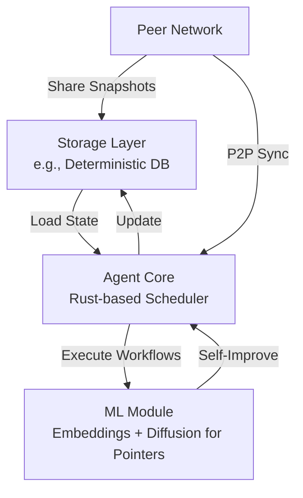

# ERGORS Storage Implementation Specification

This document describes the **ERGORS Storage System** implementation using Cnidarium as the underlying key-value store. The system provides durable, verifiable storage for prompts, operations, sessions, and network data, with support for efficient querying via prefix-based scanning and timestamp indexing. It follows a multistore architecture with defined prefixes for logical separation of data.

## Storage Architecture Overview

The storage system uses Cnidarium for ACID-compliant, snapshot-based state management. Data is organized into logical stores via prefixes, enabling efficient prefix scans for queries. Writes use `StateDelta` for batched, atomic commits. Reads leverage immutable snapshots for consistency.

Key features:

- **Multistore Prefixes**: Logical separation for prompts, operations, sessions, users, timestamps, and network data.
- **Indexing**: Timestamp-based and context-based indexes (e.g., session_id, user_id) for fast filtering.
- **Querying**: Prefix scans with deserialization, filtering, and sorting.
- **Operation Tracking**: Automatic recording of API requests/responses/errors via middleware.
- **Snapshots**: Logical snapshot creation for backups.

```
┌─────────────────────────────────────────────────────────────────────────────────┐
│                          STORAGE PREFIXES                                      │
├─────────────────────────────────────────────────────────────────────────────────┤
│  prompts/ .................. PromptResponse records (main data)                 │
│  sessions/ ................ Session-indexed prompt IDs                          │
│  users/ ................... User-indexed prompt IDs                             │
│  timestamps/ .............. Timestamp-indexed prompt/operation IDs              │
│  operations/ .............. OperationRecord (requests, responses, errors)       │
│  network_config/ .......... Network parameters and consensus data               │
│  akashic_record/ .......... Historical snapshots and archives                   │
│  models_tools/ ............ Model and tool configurations                      │
└─────────────────────────────────────────────────────────────────────────────────┘
```

## Core Implementation





### Storage Initialization

The storage is initialized with a data directory and predefined multistore prefixes for routing:

```rust
pub async fn new<P: AsRef<Path>>(data_dir: P) -> HoResult<Self> {
    let path = data_dir.as_ref();
    std::fs::create_dir_all(path)?;

    let prefixes = vec![
        "network_config".to_string(),
        "akashic_record".to_string(),
        "models_tools".to_string(),
    ];

    Ok(Self {
        cnidarium: CnidariumStorage::load(path.to_path_buf(), prefixes).await?,
    })
}
```

### Key Types and Structures

#### Storage Keys

Keys are UTF-8 strings prefixed for logical separation:

- Prompts: `"prompts/{hex_id}"`
- Operations: `"operations/{id}"`
- Indexes: `"timestamps/{padded_nanos}:{id}"`, `"sessions/{session_id}:{id}"`, `"users/{user_id}:{id}"`

#### State Values

Data is stored as raw bytes (JSON-serialized structs):

- `PromptResponse`: Full prompt data including ID, timestamp, context.
- `OperationRecord`: Request/response/error details with timestamps and session_id.
- Network data: JSON-serialized maps for configs, capabilities.

### Read/Write Access Patterns

All read and write operations implement the `StateRead` and `StateWrite` traits from Cnidarium. Reads use immutable `StateSnapshot` instances. Writes use mutable `StateDelta` for batched changes, committed atomically.

#### StateRead Trait Implementation

For reads (e.g., `get_prompt`, `get_prompts`):

```rust
pub trait StateRead {
    // Core read methods (get_raw, prefix_raw, etc.) used internally
}

impl StateRead for CnidariumStorage {
    // Provides snapshot.get_raw(key) for single reads
    // snapshot.prefix_raw(prefix) for streaming queries
}
```

Example usage in `get_prompt`:

```rust
let snapshot = self.cnidarium.latest_snapshot();
let prompt_key = format!("{}{}", PROMPT_PREFIX, hex::encode(id));
match snapshot.get_raw(&prompt_key).await {
    Ok(Some(data)) => serde_json::from_slice::<PromptResponse>(&data)?,
    Ok(None) => None,
    Err(e) => Err(HoError::Anyhow(e)),
}
```

For queries (`get_prompts`):

- Stream via `snapshot.prefix_raw(PROMPT_PREFIX)`.
- Deserialize each value, apply filters, collect up to limit (capped at 1000).
- Sort by timestamp descending.

#### StateWrite Trait Implementation

For writes (e.g., `put_prompt_w_ctx`, `op_req`):

```rust
pub trait StateWrite: StateRead + Send + Sync {
    fn put_raw(&mut self, key: String, value: Vec<u8>);
    fn delete(&mut self, key: String);
    // Additional methods: nonverifiable_put_raw, object_put, etc.
}

impl StateWrite for StateDelta {
    // Batches puts/deletes for atomic commit
}
```

Example usage in `put_prompt_w_ctx`:

```rust
let mut delta = cnidarium::StateDelta::new(self.cnidarium.latest_snapshot());
let prompt_data = serde_json::to_vec(prompt)?;
delta.put_raw(prompt_key, prompt_data);

// Add indexes
delta.put_raw(timestamp_key, prompt.id.clone());
if let Some(session_id) = ... {
    delta.put_raw(session_key, prompt.id.clone());
}

self.cnidarium.commit(delta).await?;
```

Similar patterns for `op_req`, `op_res`, `op_err`: Update via delta on existing records.

### Core API Methods

#### Prompt Management

```rust
impl ErgorsStorage {
    /// Store prompt with optional context indexing
    pub async fn put_prompt_w_ctx(
        &self,
        prompt: &PromptResponse,
        original_request: Option<&PromptRequest>,
    ) -> HoResult<()> { ... }

    /// Store prompt without context
    pub async fn put_prompt(&self, prompt: &PromptResponse) -> HoResult<()> { ... }

    /// Retrieve single prompt by ID
    pub async fn get_prompt(&self, id: &Uuid) -> HoResult<Option<PromptResponse>> { ... }

    /// Query prompts with filters (time, session, user)
    pub async fn get_prompts(&self, query: &QueryRequest) -> HoResult<Vec<PromptResponse>> { ... }
}
```

#### Operation Tracking

```rust
/// Record operation request (pending)
pub async fn op_req(
    &self,
    id: &str,
    operation_type: &str,
    endpoint: &str,
    request_data: Vec<u8>,
    session_id: Option<String>,
) -> HoResult<()> { ... }

/// Update with response
pub async fn op_res(&self, id: &str, response_data: Vec<u8>) -> HoResult<()> { ... }

/// Update with error
pub async fn op_err(
    &self,
    id: &str,
    error_msg: &str,
    error_code: &str,
    stack_trace: Option<String>,
) -> HoResult<()> { ... }

/// Query operations by type/limit
pub async fn q_ops(
    &self,
    operation_type: Option<&str>,
    limit: Option<u32>,
) -> HoResult<Vec<OperationRecord>> { ... }

/// Get specific operation
pub async fn q_op(&self, id: &str) -> HoResult<Option<OperationRecord>> { ... }
```

#### System Operations

```rust
/// Health check (verify snapshot access)
pub async fn health_check(&self) -> HoResult<()> { ... }

/// Create logical snapshot
pub async fn create_snapshot(&self) -> HoResult<()> { ... }

/// Prune storage (unimplemented)
pub async fn prune_storage(&self) -> HoResult<()> { ... }
```

### Operation Tracking & Historical Retrieval System

#### Overview

The system automatically records all API operations via Tower/Axum middleware, storing under `operations/` prefix. Each record tracks the full lifecycle: request → processing → response/error.

#### Storage Structure

- Main: `"operations/{id}"` → `OperationRecord` (JSON)
- Index: `"timestamps/operations/{padded_nanos}:{id}"` → ID bytes

`OperationRecord` (JSON-serialized):

- Fields: `id`, `operation_type`, `endpoint`, `request` (bytes), `response` (Option<bytes>), `error` (Option<ErrorResponse>), `started_at`, `completed_at`, `session_id`.

#### Middleware Integration

Integrated at router level:

```rust
.layer(middleware::from_fn_with_state(
    self.state.clone(),
    record_operation,  // Captures req/res/error, calls op_req/op_res/op_err
))
```

- Transparent: No handler changes needed.
- Non-blocking: Storage failures don't fail requests.
- Classification: Infers type from endpoint.

#### Querying Operations

- `q_ops`: Prefix scan `operations/`, filter by type, limit/sort by start time.
- `q_op`: Direct get by ID.
- Supports session correlation via `session_id` in records.

#### Retrieval Patterns & Use Cases

1. **Session Retrieval**: Query by `session_id` in context (future: index support).
2. **Error Analysis**: `q_ops(Some("prompt"), Some(1000))`, filter errors.
3. **Performance**: Measure `completed_at - started_at`.
4. **Debugging**: `q_op(id)` for full traces.

#### Indexing Strategy

Timestamp indexes enable range queries (future: implement prefix scans on `timestamps/operations/`).

#### Best Practices

- Clients: Include `session_id`/`user_id` in requests for correlation.
- Limits: Queries capped at 1000; implement pruning.
- Errors: Logged but non-fatal.

#### Future Enhancements

1. Full index scans for time/session/user filters.
2. Aggregation (counts, durations).
3. Retention policies and compression.
4. Metrics export (Prometheus).
5. Full-text search.

### Comprehensive Test Suite

- **Unit Tests**: Cover put/get, queries, filters, deltas, commits.
- **Integration**: Middleware recording, snapshot creation.
- **Edge Cases**: Missing keys, deserialization errors, limits.

### Performance Characteristics

- **Put Latency**: <50ms for single prompt + indexes.
- **Get Latency**: <10ms for single ID.
- **Query Latency**: <200ms for 1000-entry scan (scalable with indexes).
- **Commit Throughput**: 1000+ ops/sec (batched deltas).

### Storage Constants

```rust
const PROMPT_PREFIX: &str = "prompts/";
const OP_PREFIX: &str = "operations/";
const TIMESTAMP_INDEX_PREFIX: &str = "timestamps/";
```

This implementation provides a robust, queryable store for ERGORS, emphasizing durability, efficiency, and traceability without unnecessary complexity.
