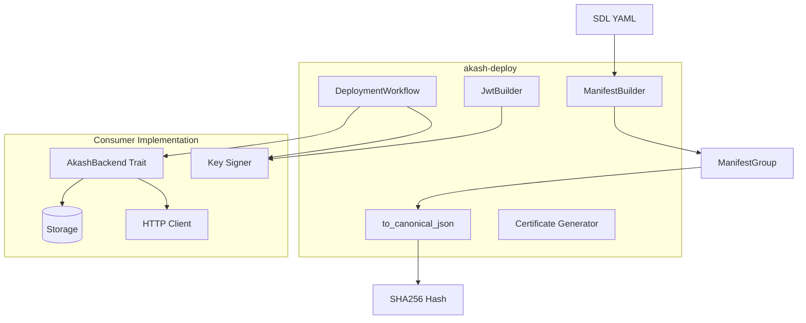
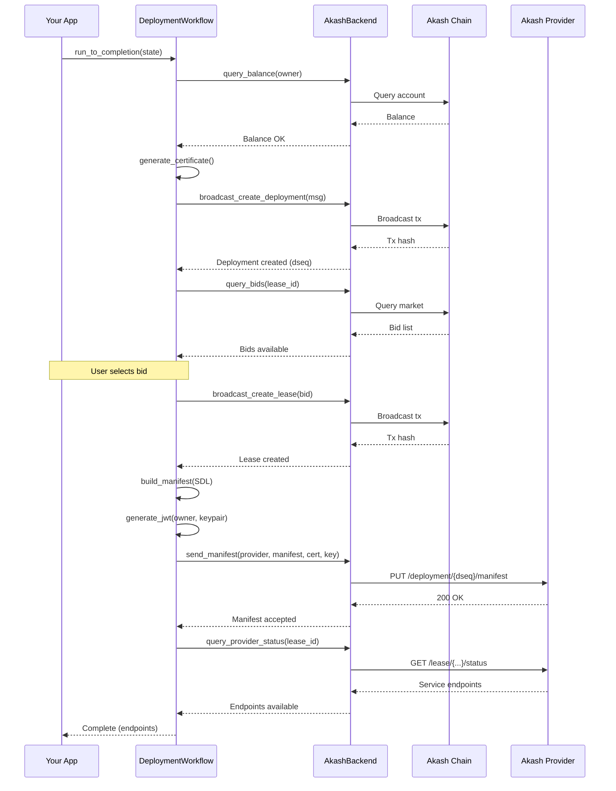

# akash-deploy

**Standalone deployment workflow engine for Akash Network.**

Build, authenticate, and deploy applications to Akash using a trait-based state machine. No storage, signing, or transport coupling — bring your own infrastructure.

---

## Features

- **SDL → Manifest** — Parse SDL YAML to provider-ready JSON with correct serialization
- **Canonical JSON** — Deterministic hashing that matches Go provider validation
- **JWT Authentication** — ES256K self-attested tokens for provider communication
- **Certificate Generation** — TLS certs with encrypted private key storage
- **Workflow Engine** — State machine for full deployment lifecycle
- **Backend Agnostic** — Single `AkashBackend` trait, you implement persistence/transport

---

## Quick Start

```rust
use akash_deploy::{ManifestBuilder, to_canonical_json};

// 1. Parse SDL to manifest
let builder = ManifestBuilder::new("akash1owner...", 12345);
let manifest_groups = builder.build_from_sdl(sdl_yaml)?;

// 2. Serialize to canonical JSON (for hash matching)
let canonical_json = to_canonical_json(&manifest_groups)?;

// 3. Compute hash (matches provider validation)
use sha2::{Digest, Sha256};
let hash = Sha256::digest(canonical_json.as_bytes());
```

### Full Workflow Example

```rust
use akash_deploy::{AkashBackend, DeploymentWorkflow, DeploymentState};

// Implement the backend trait with your infrastructure
struct MyBackend { /* your storage, HTTP client, etc. */ }

impl AkashBackend for MyBackend {
    async fn query_balance(&self, address: &str) -> Result<u64, DeployError> {
        // Your chain query implementation
    }
    // ... other methods
}

// Run deployment workflow
let backend = MyBackend::new();
let signer = MySigner::new();
let workflow = DeploymentWorkflow::new(&backend, &signer, Default::default());

let mut state = DeploymentState::new("session-1", "akash1owner...")
    .with_sdl(sdl_content)
    .with_label("my-app");

match workflow.run_to_completion(&mut state).await? {
    StepResult::Complete => println!("Deployed!"),
    StepResult::NeedsInput(input) => { /* handle user decisions */ }
    _ => {}
}
```

---

## Architecture



### Components

| Component | Purpose | Dependencies |
|-----------|---------|--------------|
| **ManifestBuilder** | SDL parsing → JSON manifest | None |
| **to_canonical_json** | Deterministic JSON serialization | None |
| **JwtBuilder** | ES256K JWT construction | Consumer provides signing |
| **CertificateGenerator** | TLS cert generation | None |
| **DeploymentWorkflow** | State machine orchestration | AkashBackend trait |

---

## Deployment Workflow



---

## Critical Serialization Details

Provider JSON API has strict requirements. `ManifestBuilder` handles these correctly:

| Requirement | Implementation |
|-------------|----------------|
| CPU units | STRING millicores: `"1000"` not `1.0` |
| Memory/storage | STRING bytes: `"536870912"` not int |
| Empty arrays | `null` not `[]` for command/args/env |
| Field names | camelCase: `externalPort` not `external_port` |
| GPU attributes | Composite keys: `vendor/nvidia/model/h100/ram/80Gi` |
| Storage attributes | Sorted by key |
| Services | Sorted by name |

**Canonical JSON is required** — Go's `encoding/json` sorts keys, we must match for hash validation.

---

## Design Principles

1. **Single Trait** — `AkashBackend` is the only interface
2. **Bring Your Own Infrastructure** — No storage, HTTP, or signing coupling
3. **State Machine Focused** — Workflow orchestrates, you implement primitives
4. **Explicit Errors** — `DeployError` covers all failure modes
5. **Type Safety** — Correct manifest serialization enforced at compile time

---

## Testing

Unit tests for manifest building and JWT generation:

```bash
cargo test -p akash-deploy
```

Integration tests against real Go provider validation:

```bash
cd ../../tests/scripts/jwt-verify
just test
```

---

## Reference Implementation

See [`ergors`](../ergors/src/deploy/) for a full implementation:
- `manifest.rs` — Shows how to use JWT types and provider communication
- `deployment_builder.rs` — Protobuf message building on top of manifest
- `automated.rs` — Complete deployment automation

---

## TODO

- [ ] Wire in chain-sdk-rs types for protobuf messages
- [ ] Add more SDL parsing examples
- [ ] Document AkashBackend trait methods in detail
