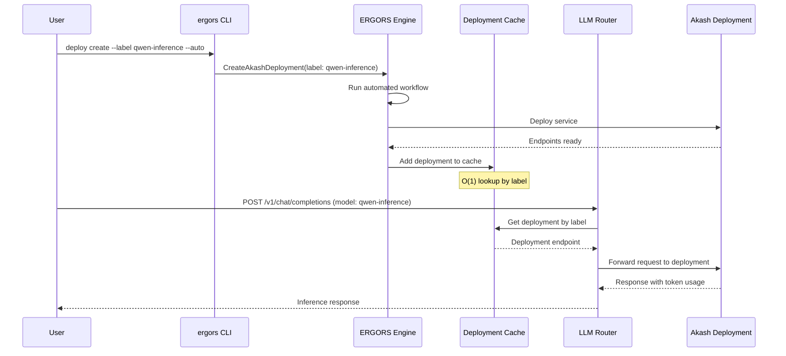

# ERGORS Engine CLI Reference

Main ERGORS engine daemon with HTTP API and gRPC management server.

```bash
ergors [OPTIONS] <COMMAND>
```

## Global Options

| Flag | Description | Default | Env Var |
|------|-------------|---------|---------|
| `--home <PATH>` | Home directory for configuration and data | `~/.ergors` | `NODE_DATA_PATH` |
| `--log-level <LEVEL>` | Log level (trace, debug, info, warn, error) | `info` | - |

## Command Groups

| Group | Description | Commands |
|-------|-------------|----------|
| `start` | Start the engine daemon | - |
| `init` | Initialize configuration and setup | new, llms, providers, unsafe-wipe, migrate |
| `config` | Manage configuration values | set, get, list, init |
| `manage-auth` | User authentication management | register, revoke |
| `keys` | Manage Cosmos funding keys | import-mnemonic, list, delete, set-default |
| `gateway` | Communication gateway management | list, status, enable, disable, discord |

---

## Start Command

| Command | Description | Options | Example |
|---------|-------------|---------|---------|
| `start` | Start engine (HTTP API + gRPC server) | `--grpc-port <PORT>` - gRPC management port (default: `50051`, env: `ERGORS_GRPC_PORT`) | `ergors start --grpc-port 60051` |

**Notes:**

- Starts HTTP API server for LLM proxying and data capture
- Starts gRPC management server for remote control via ergors
- Creates PID file to prevent multiple instances
- Handles SIGTERM/SIGINT for graceful shutdown

---

## Init Commands

| Command | Description | Options/Arguments | Example |
|---------|-------------|-------------------|---------|
| `init new` | Initialize new node with full setup | Auto-generates:<br>- Encrypted node identity (Ed25519)<br>- SSH keys from custody<br>- API key encryption<br>- Sample .env file | `ergors init new` |
| `init llms` | Configure LLM provider API keys | Prompts for API keys:<br>- Anthropic (Claude)<br>- OpenAI (GPT)<br>- Ollama (local)<br>- Grok (xAI)<br>- Akash ML<br>Saves to `api-keys.toml` | `ergors init llms` |
| `init providers` | Configure provider key sharing | Sets per-provider ownership:<br>- `shared` - Shamir secret sharing<br>- `local` - Node-only<br>Configures k-of-n threshold | `ergors init providers` |
| `init unsafe-wipe` | Delete all data in home directory | **DESTRUCTIVE** - Removes all config and data | `ergors init unsafe-wipe` |
| `init migrate` | Migrate from major versions | (TODO: not implemented) | `ergors init migrate` |

**Init New Details:**

1. Creates encrypted custody (password-protected Ed25519 key)
2. Generates SSH keys from custody for git operations
3. Prompts for LLM API keys and encrypts with custody password
4. Writes sample `.env` file from template
5. Password must be at least 8 characters
6. Password can be set via `ERGORS_CUSTODY_PASSWORD` env var for non-interactive setup

**Provider Sharing:**

- Default: Anthropic/OpenAI → `shared` (2-of-3 threshold)
- Default: Ollama → `local` (no sharing)
- Shared keys distributed via Shamir secret sharing from coordinator
- Threshold format: `k-of-n` (e.g., `2-of-3` means 2 shares needed from 3 total)

---

## Config Commands

| Command | Description | Options/Arguments | Example |
|---------|-------------|-------------------|---------|
| `config init` | Initialize minimal valid configuration | `--node-type <TYPE>` - coordinator, executor, referee, development (default: `development`)<br>`--api-port <PORT>` - gRPC/API port (default: `50051`)<br>`--p2p-port <PORT>` - P2P port (default: `26656`)<br>`--with-sdl-contract` - Deploy SDL template contract on startup<br>`--sdl-wasm-path <PATH>` - Path to SDL WASM file (required if --with-sdl-contract) | `ergors config init --node-type executor --api-port 50051 --p2p-port 26656` |
| `config set <KEY> <VALUE>` | Set configuration value | `<KEY>` - Dot-separated path (e.g., `network.listen_port`)<br>`<VALUE>` - Value (type validated) | `ergors config set network.listen_port 9090` |
| `config get <KEY>` | Get configuration value | `<KEY>` - Dot-separated path | `ergors config get identity.node_type` |
| `config list` | List all configuration keys and types | - | `ergors config list` |

**Available Config Keys:**

| Section | Key | Type | Description |
|---------|-----|------|-------------|
| **Home** | `home` | string | Home directory path |
| **Identity** | `identity.host` | string | Node hostname/IP |
| | `identity.p2p_port` | u32 | P2P listening port |
| | `identity.api_port` | u32 | API/gRPC port |
| | `identity.user` | string | Username |
| | `identity.os` | i32 | OS type (1=Linux, 2=MacOS, 3=Windows) |
| | `identity.ssh_port` | u32 | SSH port |
| | `identity.node_type` | string | Coordinator, Executor, Referee, Development |
| **Network** | `network.node_type` | i32 | 1=Coordinator, 2=Executor, 3=Referee, 4=Development |
| | `network.listen_port` | u32 | P2P listening port |
| | `network.listen_address` | string | Bind address (e.g., 0.0.0.0) |
| | `network.connection_timeout_ms` | u32 | Connection timeout in ms |
| | `network.enable_discovery` | bool | Enable peer discovery |
| **Storage** | `storage.data_dir` | string | Data directory path |
| | `storage.max_size_mb` | u32 | Maximum storage size in MB |
| | `storage.enable_compression` | bool | Enable data compression |
| **LLM** | `llm.api_keys_file` | string | Path to API keys file |
| | `llm.timeout_seconds` | u64 | Request timeout |
| | `llm.max_retries` | u32 | Maximum retry attempts |
| | `llm.default_strategy` | i32 | Model selection strategy |
| **CosmWasm** | `cosmwasm.enabled` | bool | Enable CosmWasm VM |
| | `cosmwasm.cache_dir` | string | WASM cache directory |
| | `cosmwasm.memory_limit` | u64 | Memory limit in bytes |

---

## Auth Commands

| Command | Description | Options/Arguments | Example |
|---------|-------------|-------------------|---------|
| `manage-auth register` | Register user key pair for API access | `--auth <BASE64_JSON>` - Base64-encoded auth structure | `ergors manage-auth register --auth <base64>` |
| `manage-auth revoke` | Revoke user key pair | `--auth <BASE64_JSON>` - Base64-encoded auth structure | `ergors manage-auth revoke --auth <base64>` |

**Notes:**

- (Implementation incomplete - placeholder for contract-based authentication)
- Will integrate with CosmWasm authenticator contracts for programmable API access control
- Supports Ed25519 signature-based authentication fallback

---

## Keys Commands

Manage Cosmos blockchain funding keys (Akash, Cosmos Hub, etc.) for deployment operations.

| Command | Description | Options/Arguments | Example |
|---------|-------------|-------------------|---------|
| `keys import-mnemonic` | Import BIP-39 mnemonic seed phrase | `--label <LABEL>` - Human-readable label (required)<br>`--key-name <NAME>` - Internal identifier (default: `default`)<br>`--chain-id <ID>` - Chain ID (default: `akashnet-2`)<br>`--address-prefix <PREFIX>` - Bech32 prefix (default: `akash`)<br>`--make-default` - Set as default key | `ergors keys import-mnemonic --label "My Akash Key" --make-default` |
| `keys list` | List all stored keys | Shows: name, label, address, chain ID, default marker | `ergors keys list` |
| `keys delete` | Delete a key by name | `--key-name <NAME>` - Key name to delete (required) | `ergors keys delete --key-name old-key` |
| `keys set-default` | Set a key as the default | `--key-name <NAME>` - Key name to make default (required) | `ergors keys set-default --key-name prod` |

**Security:**

- **Mnemonic input is hidden** - entered interactively like a password (never visible, never in shell history)
- All mnemonics encrypted with Argon2id + ChaCha20Poly1305
- Password-protected key store
- Mnemonics never persisted in plaintext
- Secure password prompt (hidden input)
- Password confirmation required for new stores
- File permissions set to 0600 (owner read/write only) on Unix
- For automation: use `ERGORS_MNEMONIC` env var (cleared after reading)

**Example Output:**

```
NAME            LABEL                ADDRESS                                       CHAIN        DEFAULT
--------------------------------------------------------------------------------
prod            My Akash Key         akash1abc123...                                akashnet-2   *
test            Test Key             akash1xyz789...                                akashnet-2
```

---

## Storage

ERGORS uses Cnidarium (JMT-based verifiable storage) for:

- Encrypted key stores (Cosmos mnemonics, API keys)
- LLM request/response capture
- Session state and metadata
- CosmWasm contract state

**Storage Location:** `$HOME/data/` (configurable via `storage.data_dir`)

**Encryption:**

- Custody keys: Password-encrypted Ed25519 (ChaCha20Poly1305)
- API keys: Custody password-encrypted
- Cosmos keys: Argon2id + ChaCha20Poly1305 with separate password

---

## HTTP API Endpoints

When running, the engine exposes:

| Endpoint | Description |
|----------|-------------|
| `/v1/chat/completions` | OpenAI-compatible chat completions (proxies to configured provider or deployment) |
| `/v1/messages` | Anthropic-compatible messages API |
| `/v1/models` | List available models (configured providers + active Akash deployments) |
| `/health` | Health check endpoint |
| `/metrics` | Prometheus-compatible metrics |

**API Features:**

- Automatic LLM provider routing based on model name
- **Deployment-first routing**: Active Akash deployments prioritized over configured providers
- Deployment labels usable as model names in inference requests
- Request/response capture to Cnidarium storage with token usage tracking
- Session management with fractal hierarchy
- Rate limiting via token bucket (configurable)
- Streaming support for both OpenAI and Anthropic formats
- Automated cache refresh (30s) syncs deployments with inference router

---

## gRPC Management Server

Used by `ergors` for remote management:

| Service | Methods |
|---------|---------|
| `ManagementService` | 70+ RPC methods for node control, deployment, network management |

**Default Address:** `0.0.0.0:50051` (configurable via `--grpc-port`)

### Deployment Management RPCs

| RPC Method | Purpose |
|------------|---------|
| `CreateAkashDeployment` | Initialize new deployment workflow session |
| `RunAkashDeployment` | Execute automated deployment workflow |
| `GetAkashDeployment` | Get deployment workflow details |
| `ListAkashDeployments` | List all deployment sessions |
| `QueryAkashBids` | Query available provider bids |
| `SelectAkashProvider` | Select provider and create lease |
| `CloseAkashLease` | Close active lease (keeps deployment) |
| `CloseAkashDeployment` | Close deployment and release funds |
| `UpdateAkashDeployment` | Update deployment with new SDL |
| `TopupAkashEscrow` | Add funds to escrow account |
| `GetLeaseStatus` | Get lease status and endpoints |
| `AddTrustedProvider` | Add provider to trusted list |
| `RemoveTrustedProvider` | Remove provider from trusted list |
| `ListTrustedProviders` | List all trusted providers |

See `ergors` documentation for available management operations.

---

## Daemon Management

ERGORS uses PID file locking to prevent multiple instances:

**PID File:** `$HOME/ergors.pid`

**Signals:**

- `SIGTERM` / `SIGINT` - Graceful shutdown (releases PID lock, closes storage)
- `SIGHUP` - Reload configuration (not implemented)

**Process Management:**

- Checks for existing process on startup
- Acquires PID lock before initializing
- Releases lock on clean exit or crash
- Auto-cleanup on normal termination

---

## Environment Variables

| Variable | Description |
|----------|-------------|
| `NODE_DATA_PATH` | Override default home directory |
| `ERGORS_GRPC_PORT` | Override default gRPC port |
| `ERGORS_CUSTODY_PASSWORD` | Non-interactive custody password (for automation) |
| Provider-specific | `ANTHROPIC_API_KEY`, `OPENAI_API_KEY`, `GROK_API_KEY`, `AKASHML_API_KEY` |

---

## Exit Codes

| Code | Description |
|------|-------------|
| `0` | Success |
| `1` | General error (config load failed, storage error, etc.) |
| Non-zero | Runtime error with message on stderr |

---

## Deploy Commands

Akash deployment management for automated service provisioning.

### Create Deployment

```bash
ergors deploy create --sdl <path> [OPTIONS]
```

| Option | Description | Default |
|--------|-------------|---------|
| `--sdl <PATH>` | Path to SDL YAML file | Required (or --sdl-content) |
| `--sdl-content <YAML>` | Raw SDL YAML content | - |
| `--label <LABEL>` | User-friendly label for deployment (must be unique across active deployments) | - |
| `--key-name <NAME>` | Key name for signing | `default` |
| `--account-index <N>` | HD account index | `0` |
| `--node <URL>` | Akash RPC endpoint | env: `AKASH_NODE` |
| `--chain-id <ID>` | Chain ID | env: `AKASH_CHAIN_ID` |
| `--auto` | Run automated deployment | - |
| `--skip-grants` | Skip authz/feegrant setup | - |
| `--auto-select-bid` | Auto-select cheapest trusted provider | - |
| `--min-balance <UAKT>` | Minimum balance required | `5000000` |
| `--var <KEY=VALUE>` | SDL template variables | - |

**Automated Deployment Flow (--auto):**

1. Check wallet balance (fails if < min-balance)
2. Check/create Akash certificate
3. Create deployment on chain (MsgCreateDeployment)
4. Poll for provider bids (~12-30s)
5. Select provider (cheapest or from trusted list)
6. Create lease (MsgCreateLease)
7. Send manifest to provider
8. Retrieve and save service endpoints

**Automatic Cleanup on Failure:**

If any step fails after MsgCreateDeployment succeeds, the workflow automatically:
- Broadcasts `MsgCloseDeployment` to close the deployment
- Returns the escrow deposit to your wallet
- Marks the workflow as failed with error message

This prevents hanging deployments and ensures you don't lose funds on failed deployments.

If automatic cleanup fails, manually close with:
```bash
ergors deploy close-deployment <session-id>
```

**Example:**

```bash
# Fully automated deployment with label
ergors deploy create \
  --sdl sdls/embeddings/qwen.yml \
  --label qwen-inference \
  --key-name default \
  --auto \
  --auto-select-bid \
  --min-balance 10000000
```

**Label-Based Access:**

Once a deployment is created with a label, you can use the label instead of session-id in all commands:

```bash
# Access by label instead of session-id
ergors deploy info qwen-inference
ergors deploy endpoints qwen-inference
ergors deploy close-lease qwen-inference
```

**Label Behavior:**

- Labels must be unique across active deployments (collision check on creation)
- Labels become inactive when deployment completes/fails
- Historical labels remain queryable but don't conflict with new deployments
- O(1) lookups via in-memory cache for fast access

### Run Deployment

Run automated workflow on existing session:

```bash
ergors deploy run <session-id> [OPTIONS]
```

### List Deployments

```bash
ergors deploy list [--status <STATUS>] [--limit <N>]
```

### Get Deployment

```bash
ergors deploy get <session-id-or-label>
```

**Note:** All deployment commands accept either session-id OR label for lookups.

### Query Bids

```bash
ergors deploy bids <session-id>
```

### Select Provider

```bash
ergors deploy select <session-id> --provider <address> [--price <uakt>]
```

### Deployment Info (Unified View)

Get comprehensive deployment information in formatted display:

```bash
ergors deploy info <session-id> [--json]
```

**Shows:**

- Session ID, status, current workflow step
- Account address, key name, chain ID
- Deployment DSEQ and provider
- Lease information (DSEQ, GSEQ, OSEQ, provider)
- All service endpoints with URIs and ports
- Last error (if any)

**Example Output:**

```
╔══════════════════════════════════════════════════════════════╗
║             Akash Deployment Information                     ║
╠══════════════════════════════════════════════════════════════╣
║ Session ID: abc123                                           ║
║ Status:     completed                                        ║
║ Step:       Complete                                         ║
╠══════════════════════════════════════════════════════════════╣
║ Service Endpoints                                            ║
╠══════════════════════════════════════════════════════════════╣
║ Service:    sglang                                           ║
║   URI:      xyz.provider.akash.network:8000                  ║
║   Port:     8000:8000 (tcp)                                  ║
╚══════════════════════════════════════════════════════════════╝
```

### Service Endpoints

Get service endpoints for accessing deployed services:

```bash
ergors deploy endpoints <session-id> [--json]
```

**Shows:**

- Service name
- External URI (accessible endpoint)
- Internal and external port mappings
- Protocol (tcp, udp, http)

**Example:**

```bash
ergors deploy endpoints my-session-123

Service Endpoints for my-session-123
═══════════════════════════════════════════

Service: sglang
  URI:          xyz.provider.akash.network:8000
  Internal Port: 8000
  External Port: 30001
  Protocol:      tcp

Total: 1 endpoint(s)
```

### Close Lease

Close the active lease (deployment remains on-chain):

```bash
ergors deploy close-lease <session-id>
```

**Notes:**

- Closes lease with provider
- Deployment remains active on-chain
- Can create new lease later

### Close Deployment

Close deployment completely (also closes any leases):

```bash
ergors deploy close-deployment <session-id>
```

**Process:**

1. Broadcasts `MsgCloseDeployment` to Akash chain
2. Closes deployment and any active leases
3. Releases all escrow funds
4. Updates workflow status to `Cancelled`

**Notes:**

- Permanent closure
- All escrow funds returned
- Cannot be reopened

### Certificate Management

Akash deployments require X.509 certificates for mTLS authentication with providers.

#### Create Certificate

Create or retrieve an Akash mTLS certificate:

```bash
ergors deploy cert create [--key-name <NAME>] [--account-index <N>]
```

| Option | Description | Default |
|--------|-------------|---------|
| `--key-name <NAME>` | Key name for signing | `default` |
| `--account-index <N>` | HD account index | `0` |

**Process:**

1. Derives Akash address from key
2. Queries chain for existing valid certificate
3. If found and key is stored locally, reuses it
4. If not found, generates new X.509 certificate
5. Broadcasts `MsgCreateCertificate` to Akash chain
6. Stores encrypted private key in cnidarium storage

#### Show Certificates

List certificates for an address from chain:

```bash
ergors deploy cert show [--key-name <NAME>] [--account-index <N>]
```

**Output:**
- Lists all certificates (valid and revoked)
- Shows whether private key is stored locally
- Warns if valid cert exists but key is missing

#### Revoke Certificate

Revoke an Akash certificate:

```bash
ergors deploy cert revoke [--key-name <NAME>] [--account-index <N>] [--serial <SERIAL>]
```

| Option | Description | Default |
|--------|-------------|---------|
| `--key-name <NAME>` | Key name for signing | `default` |
| `--account-index <N>` | HD account index | `0` |
| `--serial <SERIAL>` | Certificate serial to revoke | First valid cert |

**Process:**

1. Broadcasts `MsgRevokeCertificate` to Akash chain
2. Deletes encrypted private key from local storage
3. Certificate marked as revoked on-chain

**Certificate Storage:**

- Encrypted private keys are stored by owner address in cnidarium
- Keys persist across deployments and server restarts
- Uses ChaCha20Poly1305 encryption with Argon2id key derivation
- Storage key: `akash_cert_keys/{owner_address}`

**Common Issue: Missing Private Key**

If a certificate exists on chain but the private key is not in storage (created outside ERGORS):

```
WARNING: Certificate exists but private key is missing!
mTLS authentication may fail
```

**Solution:**

1. Revoke the existing certificate using Akash CLI:
   ```bash
   akash tx cert revoke --from <key>
   ```
2. Run a new deployment - ERGORS will create and store a new certificate

### Provider Information

Provider info is automatically queried and cached during bid selection:

```bash
ergors deploy provider-info <address> [--refresh]
```

**Provider Info Caching:**

- Provider info (host_uri, email, website) is cached in cnidarium storage
- Cache lookup is O(1) by provider address
- Storage key: `akash_provider_info/{provider_address}`
- Human-readable provider names shown in bid listings

### Update Deployment

Update deployment with new SDL specification:

```bash
ergors deploy update-deployment <session-id> --sdl <path>
```

**Process:**

1. Reads new SDL file from path
2. Hashes SDL with SHA256
3. Broadcasts `MsgUpdateDeployment` to Akash chain
4. Updates deployment resources

**Example:**

```bash
ergors deploy update-deployment my-session-123 --sdl ./new-config.yml
```

**Notes:**

- You may need to send new manifest to provider after update
- Use this to scale resources or change configuration

### Top Up Escrow

Add funds to deployment escrow account:

```bash
ergors deploy topup-escrow <session-id> <amount-in-uakt>
```

**Arguments:**

- `<amount-in-uakt>`: Amount in uakt (1 AKT = 1,000,000 uakt)

**Process:**

1. Creates escrow account ID with deployment scope
2. Broadcasts `MsgAccountDeposit` to Akash chain
3. Adds funds to deployment escrow

**Examples:**

```bash
# Top up with 10 AKT
ergors deploy topup-escrow my-session-123 10000000

# Top up with 0.5 AKT
ergors deploy topup-escrow my-session-123 500000
```

**Output:**

```
Escrow topped up for session: my-session-123
  Amount: 10000000 uakt (10.000000 AKT)
  Escrow topped up with 10000000 uakt for session my-session-123
```

### Deployment Status

```bash
ergors deploy status <session-id> [--follow]
```

### Trusted Providers

```bash
# List trusted providers
ergors deploy trusted-providers

# Add trusted provider
ergors deploy add-provider <address> [--label <name>]

# Remove trusted provider
ergors deploy remove-provider <address>
```

### Grant Management

```bash
# Request authz grant from coordinator
ergors deploy request-grant \
  --granter <address> \
  --grantee <address> \
  --msg-type /akash.deployment.v1beta3.MsgCreateDeployment \
  --allowance 10000000

# Approve/reject grant request
ergors deploy approve-grant <request-id> [--reject] [--reason <text>]

# Revoke existing grant
ergors deploy revoke-grant --granter <addr> --grantee <addr> [--msg-type <type>]

# List grant requests
ergors deploy list-grants [--granter <addr>] [--grantee <addr>] [--status <pending|approved>]
```

### Query Balance

```bash
ergors deploy query-balance <address> [--denom uakt]
```

---

## Deployment → Inference Integration

ERGORS automatically integrates completed Akash deployments into the inference routing system, enabling seamless model access.

### Workflow



### Usage Example

```bash
# 1. Deploy inference service with label
ergors deploy create \
  --sdl sdls/embeddings/qwen.yml \
  --label qwen-inference \
  --auto \
  --auto-select-bid

# 2. Wait for completion (~2-5 minutes)
ergors deploy info qwen-inference

# 3. Use deployment as model in inference requests
curl http://localhost:8080/v1/chat/completions \
  -H "Content-Type: application/json" \
  -d '{
    "model": "qwen-inference",
    "messages": [{"role": "user", "content": "Hello!"}]
  }'

# 4. List all available models (includes active deployments)
curl http://localhost:8080/v1/models
```

### Features

| Feature | Description |
|---------|-------------|
| **Label-as-Model** | Deployment labels become model names directly |
| **Priority Routing** | Deployments checked before configured providers (OpenAI, Anthropic) |
| **O(1) Lookup** | In-memory cache for fast routing |
| **Auto-sync** | Cache refreshes every 30s from storage |
| **Token Tracking** | Extracts token usage from OpenAI-compatible responses |
| **Lifecycle Management** | Auto-add on completion, auto-remove on close |

### Cache Behavior

- **Add to cache**: When deployment status → `Completed` with service endpoints
- **Remove from cache**: When `deploy close-lease` or `deploy close-deployment` called
- **Refresh interval**: 30 seconds (automatic background task)
- **Storage**: Backed by Cnidarium for persistence across restarts
- **Collision prevention**: Labels validated at creation time (gRPC handler)

### OpenAI Compatibility

Deployments must expose OpenAI-compatible endpoints:

| Endpoint | Request Type | Response Format |
|----------|--------------|-----------------|
| `/v1/chat/completions` | Chat messages | OpenAI ChatCompletion |
| `/v1/embeddings` | Embedding request | OpenAI Embedding |

**Token Usage Extraction:**

The router automatically extracts token counts from the `usage` field:

```json
{
  "usage": {
    "prompt_tokens": 12,
    "completion_tokens": 45,
    "total_tokens": 57
  }
}
```

These are stored in `PromptResponse.tokens_used` for observability.

---

## RAG Commands

RAG (Retrieval-Augmented Generation) vector database management.

| Command | Description | Example |
|---------|-------------|---------|
| `rag ingest <file>` | Ingest file into vector DB | `ergors rag ingest docs.md --doc-type markdown` |
| `rag query <query>` | Search vector DB | `ergors rag query "API endpoints" --top-k 5` |
| `rag status` | Show RAG system status | `ergors rag status` |
| `rag list` | List ingested sources | `ergors rag list --limit 50` |
| `rag delete <uri>` | Delete source from DB | `ergors rag delete file://docs.md` |
| `rag configure` | Configure embedder endpoint | `ergors rag configure --endpoint http://... --model qwen` |

**Ingest Options:**

| Option | Description |
|--------|-------------|
| `--uri <URI>` | Source URI (default: file path) |
| `--doc-type <TYPE>` | Document type (markdown, code, text) |
| `--tags <TAGS>` | Comma-separated tags |

---

## Gateway Commands

Communication gateway management for Discord, Nostr, and other interfaces.

**Note:** Gateway features require the `discord` feature flag: `cargo build --features discord`

### List Gateways

List all registered gateways and their status:

```bash
ergors gateway list [--json]
```

**Example Output:**

```
Communication Gateways
======================
  discord (Discord Bot) - connected
  nostr (Nostr Relay) - disabled
```

### Gateway Status

Show detailed status for a gateway:

```bash
ergors gateway status <gateway-id>
```

**Example:**

```bash
ergors gateway status discord

Gateway Status: discord
====================
Connected:   yes
Messages:    142
Last Active: 1706835200
```

### Enable/Disable Gateway

```bash
# Enable a gateway
ergors gateway enable <gateway-id>

# Disable a gateway
ergors gateway disable <gateway-id>
```

### Discord Gateway

Discord bot integration for AI chat via slash commands.

#### Configure Bot Token

Set the Discord bot token (encrypted via custody):

```bash
ergors gateway discord set-token [--token <TOKEN>]
```

**Notes:**
- If `--token` is not provided, prompts interactively (hidden input, never in shell history)
- Token is encrypted using the custody password

#### Manage Allowed Guilds

Control which Discord servers (guilds) can use the bot:

```bash
# Add guild to allowlist
ergors gateway discord allow-guild <guild-id>

# Remove guild from allowlist
ergors gateway discord deny-guild <guild-id>
```

**Notes:**
- If no guilds are in the allowlist, the bot responds to all guilds
- Guild IDs are Discord snowflake IDs (e.g., `123456789012345678`)

#### Show Configuration

Display current Discord configuration (token redacted):

```bash
ergors gateway discord config [--json]
```

**Example Output:**

```
Discord Gateway Configuration
=============================
Token:            configured (encrypted)
Command Prefix:   !
Respond to @:     true
Respond to DMs:   false

Allowed Guilds:
  - 123456789012345678
  - 987654321098765432
```

#### Available Slash Commands

Once the bot is configured and enabled, users can interact via Discord:

| Command | Description |
|---------|-------------|
| `/prompt <message>` | Send a prompt to the AI |
| `/thread [name]` | Create a new conversation thread |
| `/clear` | Clear conversation history in current thread |

### Discord Setup Workflow

```bash
# 1. Create Discord bot at https://discord.com/developers/applications
# 2. Enable "Message Content Intent" in Bot settings
# 3. Copy the bot token

# 4. Configure the gateway
ergors gateway discord set-token
# (enter token when prompted)

# 5. Allow specific guilds (optional)
ergors gateway discord allow-guild 123456789012345678

# 6. Enable the gateway
ergors gateway enable discord

# 7. Start the engine (gateways start automatically)
ergors start

# 8. Invite bot to your server using OAuth2 URL with scopes:
#    - bot
#    - applications.commands
```

### Session Management

Each Discord thread maintains its own conversation session:

- Sessions are created automatically when a user first interacts in a thread
- Use `/thread` to create a new Discord thread with a fresh session
- Use `/clear` to reset the session in the current thread
- Sessions persist across bot restarts (stored in Cnidarium)

### gRPC Management RPCs

| RPC Method | Purpose |
|------------|---------|
| `ListGateways` | List all registered gateways with status |
| `GetGatewayStatus` | Get detailed gateway status |
| `EnableGateway` | Enable a gateway |
| `DisableGateway` | Disable a gateway |
| `ConfigureDiscordGateway` | Configure Discord bot token and settings |
| `AddDiscordAllowedGuild` | Add guild to allowlist |
| `RemoveDiscordAllowedGuild` | Remove guild from allowlist |
| `GetDiscordConfig` | Get Discord configuration (token redacted) |

---

## Quick Start

```bash
# 1. Initialize new node (creates custody, SSH keys, API keys)
ergors init new

# 2. (Optional) Import Akash funding key for deployments
# Mnemonic is entered interactively (hidden input, never in shell history)
ergors keys import-mnemonic \
  --label "Akash Main" \
  --chain-id akashnet-2 \
  --make-default

# 3. Start the engine
ergors start

# 4. In another terminal, verify it's running
ergors status
```

---

## Background Services

The engine runs several background services when started:

### Deployment Cache Refresh

Maintains an in-memory cache of active Akash deployments for fast inference routing.

**Refresh Interval:** Every 30 seconds

**Process:**

1. Lists all workflows from storage
2. Filters to completed deployments with labels
3. Verifies lease is still active on chain
4. Checks escrow balance and reports low balance warnings
5. Updates cache with verified active deployments

**Chain Verification:**

- Queries lease status from Akash chain
- Removes inactive deployments from cache automatically
- Reports deployments with `InsufficientFunds` state

**Escrow Monitoring:**

- Checks escrow balance against threshold (default: 20% of initial deposit)
- Logs warnings for deployments with low balance
- Auto top-up available (disabled by default)

**Auto Top-Up (Optional):**

When enabled, automatically deposits funds to deployments with low escrow balance:

- Threshold: Configurable percentage (default: 20%)
- Top-up amount: Configurable (default: 5 AKT / 5,000,000 uakt)
- Requires signing components configured

**Cache Operations:**

| Operation | Trigger | Description |
|-----------|---------|-------------|
| Add deployment | Workflow completion | Adds deployment to cache for inference routing |
| Remove deployment | Lease closed/inactive | Removes from cache |
| Refresh | Every 30s | Verifies all cached deployments |

---

## Files Created

| File | Description | Permissions |
|------|-------------|-------------|
| `$HOME/config.toml` | Main configuration file | 0644 |
| `$HOME/.env` | Environment template (from `templates/example.env`) | 0644 |
| `$HOME/identity.enc` | Encrypted node identity (custody) | 0600 |
| `$HOME/api-keys.enc` | Encrypted LLM API keys | 0600 |
| `$HOME/providers.toml` | Provider sharing configuration | 0644 |
| `$HOME/ssh/id_ed25519` | SSH private key (from custody) | 0600 |
| `$HOME/ssh/id_ed25519.pub` | SSH public key | 0644 |
| `$HOME/data/` | Cnidarium storage directory | 0755 |
| `$HOME/wasm_cache/` | CosmWasm VM cache | 0755 |
| `$HOME/ergors.pid` | PID file (created on start) | 0644 |

---

## Logging

Logs are written to stderr using `tracing`:

```bash
# Set log level via CLI
ergors --log-level debug start

# Or via environment variable
RUST_LOG=debug ergors start

# Filter by module
RUST_LOG=ergors=debug,cnidarium=info ergors start
```

**Log Levels:**

- `trace` - Very verbose (network packets, state transitions)
- `debug` - Detailed (request/response, storage ops)
- `info` - Normal operations (startup, shutdown, key events)
- `warn` - Warning conditions (retries, degraded state)
- `error` - Error conditions (failures, exceptions)
