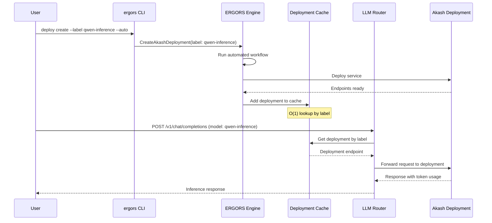

# ERGORS Engine CLI Reference

Main ERGORS engine daemon with HTTP API and gRPC management server.

```bash
ergors [OPTIONS] <COMMAND>
```

## Global Options

| Flag | Description | Default | Env Var |
| ------ | ------------- | --------- | --------- |
| `--home <PATH>` | Home directory for configuration and data | `~/.ergors` | `NODE_DATA_PATH` |
| `--grpc-addr <URL>` | Engine gRPC address | `http://localhost:50051` | `ERGORS_GRPC_ADDR` |
| `--log-level <LEVEL>` | Log level (trace, debug, info, warn, error) | `info` | - |
| `--json` | Output in JSON format for scripting | `false` | - |
| `--signing-key-hex <HEX>` | Ed25519 signing key for authenticated remote access (64 hex chars) | - | `ERGORS_SIGNING_KEY_HEX` |

## Command Groups

| Group | Description | Commands |
| ------- | ------------- | ---------- |
| `start` | Start the engine daemon | - |
| `init` | Initialize configuration and setup | new, llms, providers, unsafe-wipe, migrate |
| `config` | Manage configuration values | set, get, list, init, register-cli-key, revoke-cli-key, list-cli-keys |
| `manage-auth` | User authentication management | register, revoke |
| `keys` | Manage Cosmos funding keys | import-mnemonic, list, delete, set-default |
| `bootstrap` | Bootstrap new nodes via Akash or SSH | node, list, status, delete |
| `gateway` | Communication gateway management | list, status, enable, disable, discord |
| `sentinel` | Sentinel node bootstrap (encrypted) | bootstrap |
| `ask` | Document ingestion and querying (RAG + RLM) | ingest-file, rag, rlm, status, list, delete |
| `document` | Document storage (non-RAG) | ingest, get, list, delete, verify |
| `call` | Make inference calls through the node | - |

---

## Call Command

Send inference requests through the node's HTTP proxy. Detects API format (Anthropic vs OpenAI) from the model name and routes accordingly. Streaming is enabled by default.

```bash
ergors call [PROMPT] [OPTIONS]
```

| Option | Description | Default | Env Var |
| ------ | ----------- | ------- | ------- |
| `[PROMPT]` | Prompt text (positional). Reads from stdin if omitted. | - | - |
| `-m, --model <NAME>` | Model name (drives format detection and routing) | `claude-sonnet-4-5-20250929` | - |
| `-s, --system <TEXT>` | System prompt | - | - |
| `--max-tokens <N>` | Maximum tokens to generate | `4096` | - |
| `--no-stream` | Disable streaming (wait for full response) | `false` | - |
| `--temperature <FLOAT>` | Sampling temperature | - | - |
| `--api-addr <URL>` | HTTP API address override | Derived from `--grpc-addr` host + port 8080 | `ERGORS_API_ADDR` |

**Format Detection:**

| Model pattern | Format | Endpoint |
| ------------- | ------ | -------- |
| claude, haiku, sonnet, opus, anthropic | Anthropic | `POST /v1/messages` |
| Everything else (gpt, o1, o3, llama, etc.) | OpenAI | `POST /v1/chat/completions` |

**Examples:**

```bash
# Basic prompt (default model: claude-sonnet-4-5-20250929)
ergors call "What is life?"

# Specify model
ergors call "Hello" --model gpt-4o

# Pipe from stdin
echo "Explain this" | ergors call --model gpt-4o

# With system prompt and no streaming
ergors call "Hello" -s "You are a poet" --no-stream --model llama3

# Full JSON response (--json global flag + --no-stream)
ergors --json call "Hello" --no-stream

# Custom API address
ergors call "Hello" --api-addr http://remote-node:8080
```

**Notes:**

- The command never calls upstream providers directly — it always goes through the node's HTTP proxy
- The node handles API key resolution from custody, request capture, and model routing
- Streaming prints tokens to stdout as they arrive; pipe to a file for full capture
- Use `--json` (global flag) with `--no-stream` to get the full API response as pretty-printed JSON

---

## Start Command

| Command | Description | Options | Example |
| --------- | ------------- | --------- | --------- |
| `start` | Start engine (HTTP API + gRPC server) | `--grpc-port <PORT>` - gRPC management port (default: `50051`, env: `ERGORS_GRPC_PORT`) | `ergors start --grpc-port 60051` |

**Notes:**

- Starts HTTP API server for LLM proxying and data capture
- Starts gRPC management server for remote control via ergors
- Creates PID file to prevent multiple instances
- Handles SIGTERM/SIGINT for graceful shutdown

---

## Init Commands

| Command | Description | Options/Arguments | Example |
| --------- | ------------- | ------------------- | --------- |
| `init new` | Initialize new node with full setup | Auto-generates: - Encrypted node identity (Ed25519) - SSH keys from custody - API key encryption - Sample .env file | `ergors init new` |
| `init llms` | Configure LLM provider API keys | Prompts for API keys: - Anthropic (Claude) - OpenAI (GPT) - Ollama (local) - Grok (xAI) - Akash ML Saves to `api-keys.toml` | `ergors init llms` |
| `init providers` | Configure provider key sharing | Sets per-provider ownership: - `shared` - Shamir secret sharing - `local` - Node-only Configures k-of-n threshold | `ergors init providers` |
| `init unsafe-wipe` | Delete all data in home directory | **DESTRUCTIVE** - Requires custody password (same as `init new`). Fails if no custody exists. Removes all config, encrypted keys, deployment workflows, prompt history, and session data. | `ergors init unsafe-wipe` |
| `init migrate` | Migrate from major versions | (TODO: not implemented) | `ergors init migrate` |

**Init New Details:**

1. Creates encrypted custody (password-protected Ed25519 key)
2. Generates SSH keys from custody for git operations
3. Prompts for LLM API keys and encrypts with custody password
4. Writes sample `.env` file from template
5. Password must be at least 8 characters
6. Password can be set via `ERGORS_CUSTODY_PASSWORD` env var for non-interactive setup

**Provider Sharing:**

- Default: Anthropic/OpenAI → `shared` (2-of-3 threshold)
- Default: Ollama → `local` (no sharing)
- Shared keys distributed via Shamir secret sharing from coordinator
- Threshold format: `k-of-n` (e.g., `2-of-3` means 2 shares needed from 3 total)

---

## Provider Commands

| Command | Description | Options/Arguments | Example |
| --------- | ------------- | ------------------- | --------- |
| `provider list` | List configured LLM providers | Shows name and status (configured/disabled) for each provider. Use `--json` for machine-readable output. | `ergors provider list` |
| `provider add <NAME>` | Register an API key for a provider | `<NAME>` - Provider name (openai, anthropic, etc.) `--api-key <KEY>` - API key (prompts with hidden input if omitted) `--default` - Set as default provider | `ergors provider add openai` |
| `provider test [NAME]` | Test provider connectivity | `[NAME]` - Provider name (tests all if omitted). Reports latency in ms. | `ergors provider test openai` |
| `provider default <NAME>` | Set the default provider | `<NAME>` - Provider name | `ergors provider default anthropic` |
| `provider assign <NAME>` | Assign provider to an engine role | `<NAME>` - Provider name. `--role <ROLE>` - Engine role (possible values shown in `--help`): `orchestration`, `sub-agent`, `embeddings`, `tool-calling` | `ergors provider assign local-sglang --role orchestration` |
| `provider unassign <NAME>` | Unassign provider from an engine role | `<NAME>` - Provider name. `--role <ROLE>` - Engine role (possible values shown in `--help`) | `ergors provider unassign local-sglang --role orchestration` |
| `provider roles` | List all engine role assignments | Shows role mappings with priority order (first = primary, rest = fallback). Use `--json` for machine-readable output. | `ergors provider roles` |

**Provider Add Details:**

- API key input is hidden (rpassword) in interactive terminals; reads from stdin when piped
- Key is encrypted with the custody password and stored in Cnidarium as `custody://<name>`
- Requires custody to be initialized (via `ergors sentinel bootstrap` or `ergors init new`)
- The proxy resolves `custody://<name>` references immediately without restart

**Engine Role Assignments:**

- Roles: `orchestration` (primary LLM), `sub-agent` (task execution), `embeddings` (RAG/search), `tool-calling` (function calling)
- A provider can serve multiple roles; a role can have multiple providers (ordered by priority)
- First assigned provider = primary; additional providers = fallback
- Unassigned roles fall back to model-pattern routing (no error)
- Role config persists in cnidarium with versioned audit trail

---

## Config Commands

| Command | Description | Options/Arguments | Example |
| --------- | ------------- | ------------------- | --------- |
| `config init` | Initialize minimal valid configuration | `--node-type <TYPE>` - coordinator, executor, referee, development (default: `development`) `--api-port <PORT>` - gRPC/API port (default: `50051`) `--p2p-port <PORT>` - P2P port (default: `26656`) `--with-sdl-contract` - Deploy SDL template contract on startup `--sdl-wasm-path <PATH>` - Path to SDL WASM file (required if --with-sdl-contract) | `ergors config init --node-type executor --api-port 50051 --p2p-port 26656` |
| `config set <KEY> <VALUE>` | Set configuration value | `<KEY>` - Dot-separated path (e.g., `network.listen_port`) `<VALUE>` - Value (type validated) | `ergors config set network.listen_port 9090` |
| `config get <KEY>` | Get configuration value | `<KEY>` - Dot-separated path | `ergors config get identity.node_type` |
| `config list` | Show actual configuration values (loads config file) | `--json` - Output as JSON | `ergors config list --json` |
| `config list-chains` | List all configured Cosmos chains (requires daemon) | `--json` - Output as JSON | `ergors config list-chains --json` |
| `config delete-chain <CHAIN_ID>` | Delete a Cosmos chain configuration (password-protected, requires daemon) | `<CHAIN_ID>` - Chain ID to delete. `--json` - Output as JSON | `ergors config delete-chain local` |
| `config register-cli-key <PUBKEY_HEX>` | Register Ed25519 public key for remote CLI auth (requires daemon) | `--label <LABEL>` - Human-readable label (default: `cli`) | `ergors config register-cli-key abc123...def` |
| `config revoke-cli-key <PUBKEY_HEX>` | Revoke an authorized CLI key (requires daemon) | - | `ergors config revoke-cli-key abc123...def` |
| `config list-cli-keys` | List all authorized CLI keys (requires daemon) | `--json` - Output as JSON | `ergors config list-cli-keys` |

### Remote Authentication Workflow

To access a remote engine from a CLI:

1. **Generate an Ed25519 keypair** (any standard tool, or use the node's existing key)
2. **Register the public key on the engine** (from local access): `ergors config register-cli-key <pubkey_hex> --label "my-laptop"`
3. **Use from remote**: `ergors --grpc-addr http://remote:50051 --signing-key-hex <privkey_hex> status`
4. **Or set env var**: `export ERGORS_SIGNING_KEY_HEX=<privkey_hex>` then `ergors --grpc-addr http://remote:50051 status`

Local connections (localhost/127.0.0.1) bypass authentication entirely.

**Available Config Keys:**

| Section | Key | Type | Description |
| --------- | ----- | ------ | ------------- |
| **Home** | `home` | string | Home directory path |
| **Identity** | `identity.host` | string | Node hostname/IP |
| | `identity.p2p_port` | u32 | P2P listening port |
| | `identity.api_port` | u32 | API/gRPC port |
| | `identity.user` | string | Username |
| | `identity.os` | i32 | OS type (1=Linux, 2=MacOS, 3=Windows) |
| | `identity.ssh_port` | u32 | SSH port |
| | `identity.node_type` | string | Coordinator, Executor, Referee, Development |
| **Network** | `network.node_type` | i32 | 1=Coordinator, 2=Executor, 3=Referee, 4=Development |
| | `network.listen_port` | u32 | P2P listening port |
| | `network.listen_address` | string | Bind address (e.g., 0.0.0.0) |
| | `network.connection_timeout_ms` | u32 | Connection timeout in ms |
| | `network.enable_discovery` | bool | Enable peer discovery |
| **Storage** | `storage.data_dir` | string | Data directory path |
| | `storage.max_size_mb` | u32 | Maximum storage size in MB |
| | `storage.enable_compression` | bool | Enable data compression |
| **LLM** | `llm.api_keys_file` | string | Path to API keys file |
| | `llm.timeout_seconds` | u64 | Request timeout |
| | `llm.max_retries` | u32 | Maximum retry attempts |
| | `llm.default_strategy` | i32 | Model selection strategy |
| **CosmWasm** | `cosmwasm.enabled` | bool | Enable CosmWasm VM |
| | `cosmwasm.cache_dir` | string | WASM cache directory |
| | `cosmwasm.memory_limit` | u64 | Memory limit in bytes |

---

## Auth Commands

| Command | Description | Options/Arguments | Example |
| --------- | ------------- | ------------------- | --------- |
| `manage-auth register` | Register user key pair for API access | `--auth <BASE64_JSON>` - Base64-encoded auth structure | `ergors manage-auth register --auth <base64>` |
| `manage-auth revoke` | Revoke user key pair | `--auth <BASE64_JSON>` - Base64-encoded auth structure | `ergors manage-auth revoke --auth <base64>` |

**Notes:**

- (Implementation incomplete - placeholder for contract-based authentication)
- Will integrate with CosmWasm authenticator contracts for programmable API access control
- Supports Ed25519 signature-based authentication fallback

---

## Keys Commands

Manage Cosmos blockchain funding keys (Akash, Cosmos Hub, etc.) for deployment operations.

| Command | Description | Options/Arguments | Example |
| --------- | ------------- | ------------------- | --------- |
| `keys import-mnemonic` | Import BIP-39 mnemonic seed phrase | `--label <LABEL>` - Human-readable label (required), `--default` - Set as default, `--prefix <PREFIX>` - Bech32 prefix (default: "ergo"), `--coin-type <N>` - BIP-44 coin type (default: 118) | `ergors keys import-mnemonic --label "Akash Faucet" --prefix akash --default` |
| `keys list` | List all stored keys | `--json` - Output as JSON, `--prefix <PREFIX>` - Re-derive addresses with different bech32 prefix, `--label <LABEL>` - Filter by key label, `-a`/`--address` - Output address only (for scripting) | `ergors keys list --label faucet -a --prefix akash` |
| `keys delete` | Delete a key by label | `--label <LABEL>` - Key label to delete (required) | `ergors keys delete --label old-key` |
| `keys set-default` | Set a key as the default | `--label <LABEL>` - Key label to make default (required) | `ergors keys set-default --label prod` |

**Security:**

- **Mnemonic input is hidden** - entered interactively like a password (never visible, never in shell history)
- All mnemonics encrypted with Argon2id + ChaCha20Poly1305
- Password-protected key store
- Mnemonics never persisted in plaintext
- Secure password prompt (hidden input)
- Password confirmation required for new stores
- File permissions set to 0600 (owner read/write only) on Unix
- For automation: use `ERGORS_MNEMONIC` env var (cleared after reading)

**Chain-Agnostic Keys:**

Keys are stored without chain binding. The address uses the `ergo` prefix by default. To derive a chain-specific address (e.g., for Akash), use `ergors node address --prefix akash`.

**Example Output:**

```
LABEL                ADDRESS                                       DEFAULT
----------------------------------------------------------------------
My Key               ergo1abc123...                                 *
Test Key             ergo1xyz789...
```

**JSON Output (`--json`):**

```json
{
  "keys": [
    { "label": "My Key", "address": "ergo1abc123...", "is_default": true },
    { "label": "Test Key", "address": "ergo1xyz789...", "is_default": false }
  ]
}
```

---

## Storage

ERGORS uses Cnidarium (JMT-based verifiable storage) for:

- Encrypted key stores (Cosmos mnemonics, API keys)
- LLM request/response capture
- Session state and metadata
- CosmWasm contract state

**Storage Location:** `$HOME/data/` (configurable via `storage.data_dir`)

**Encryption:**

- Custody keys: Password-encrypted Ed25519 (ChaCha20Poly1305)
- API keys: Custody password-encrypted
- Cosmos keys: Argon2id + ChaCha20Poly1305 with separate password

---

## HTTP API Endpoints

When running, the engine exposes:

| Endpoint | Description |
| ---------- | ------------- |
| `/v1/chat/completions` | OpenAI-compatible chat completions (proxies to configured provider or deployment) |
| `/v1/messages` | Anthropic-compatible messages API |
| `/v1/models` | List available models (configured providers + active Akash deployments) |
| `/orchestrate/bootstrap` | POST - Initiate node bootstrap |
| `/orchestrate/bootstrap/sessions` | GET - List bootstrap sessions (?active=true) |
| `/orchestrate/bootstrap/sessions/{id}` | GET - Get session status, DELETE - Delete session |
| `/api/inbox/submit` | POST - Submit generic inbox message |
| `/api/inbox/grant` | POST - Submit grant request (convenience) |
| `/api/inbox/{id}` | GET - Get inbox message status |
| `/api/inbox` | GET - List pending inbox messages (protected) |
| `/api/inbox/{id}/accept` | POST - Accept inbox message (protected) |
| `/api/inbox/{id}/reject` | POST - Reject inbox message (protected) |
| `/api/inbox/config` | GET/POST - Read/update granter config (protected) |
| `/health` | Health check endpoint |
| `/metrics` | Prometheus-compatible metrics |

**API Features:**

- Automatic LLM provider routing based on model name
- **Deployment-first routing**: Active Akash deployments prioritized over configured providers
- Deployment labels usable as model names in inference requests
- Request/response capture to Cnidarium storage with token usage tracking
- Session management with fractal hierarchy
- Rate limiting via token bucket (configurable)
- Streaming support for both OpenAI and Anthropic formats
- Automated cache refresh (30s) syncs deployments with inference router

---

## gRPC Management Server

Used by `ergors` for remote management:

| Service | Methods |
| --------- | --------- |
| `ManagementService` | 70+ RPC methods for node control, deployment, network management |

**Default Address:** `0.0.0.0:50051` (configurable via `--grpc-port`)

### Deployment Management RPCs

| RPC Method | Purpose |
| ------------ | --------- |
| `CreateAkashDeployment` | Initialize new deployment workflow session |
| `RunAkashDeployment` | Execute automated deployment workflow |
| `GetAkashDeployment` | Get deployment workflow details |
| `ListAkashDeployments` | List all deployment sessions |
| `QueryAkashBids` | Query available provider bids |
| `SelectAkashProvider` | Select provider and create lease |
| `CloseAkashLease` | Close active lease (keeps deployment) |
| `CloseAkashDeployment` | Close deployment and release funds |
| `UpdateAkashDeployment` | Update deployment with new SDL |
| `TopupAkashEscrow` | Add funds to escrow account |
| `GetLeaseStatus` | Get lease status and endpoints |
| `AddTrustedProvider` | Add provider to trusted list |
| `RemoveTrustedProvider` | Remove provider from trusted list |
| `ListTrustedProviders` | List all trusted providers |

See `ergors` documentation for available management operations.

---

## Daemon Management

ERGORS uses PID file locking to prevent multiple instances:

**PID File:** `$HOME/ergors.pid`

**Signals:**

- `SIGTERM` / `SIGINT` - Graceful shutdown (releases PID lock, closes storage)
- `SIGHUP` - Reload configuration (not implemented)

**Process Management:**

- Checks for existing process on startup
- Acquires PID lock before initializing
- Releases lock on clean exit or crash
- Auto-cleanup on normal termination

---

## Environment Variables

| Variable | Description |
| ---------- | ------------- |
| `NODE_DATA_PATH` | Override default home directory |
| `ERGORS_GRPC_PORT` | Override default gRPC port |
| `ERGORS_CUSTODY_PASSWORD` | Non-interactive custody password (for automation) |
| Provider-specific | `ANTHROPIC_API_KEY`, `OPENAI_API_KEY`, `GROK_API_KEY`, `AKASHML_API_KEY` |
| `ERGORS_API_ADDR` | Override HTTP API address (default: derived from gRPC host + port 8080) |
| `BOOTSTRAP_IMAGE_TAG` | Override default Docker image tag for bootstrapped nodes |

---

## Exit Codes

| Code | Description |
| ------ | ------------- |
| `0` | Success |
| `1` | General error (config load failed, storage error, etc.) |
| Non-zero | Runtime error with message on stderr |

---

## Bootstrap Commands

Bootstrap new ergors nodes via Akash cloud deployment. Uses HTTP API endpoints on the running daemon.

### Bootstrap Node

```bash
ergors bootstrap node [OPTIONS]
```

| Option | Description | Default |
| -------- | ------------- | --------- |
| `--node-type <TYPE>` | Node type: coordinator, executor | `executor` |
| `--image <TAG>` | Docker image tag | Latest from registry |
| `--method <METHOD>` | Bootstrap method: akash, ssh | `akash` |
| `--peers <ADDRS>` | Comma-separated bootstrap peer addresses | Coordinator's own address |
| `--env <KEY=VALUE>` | Custom environment variables (repeatable) | - |
| `--ssh <USER@HOST:PORT>` | SSH connection string (for ssh method) | - |

**Bootstrap Flow (Akash):**

1. Generate Ed25519 identity + config for new node
2. Create Akash deployment with node Docker image
3. Wait for deployment to become ready
4. Establish P2P connection with new node
5. Send config.toml and encrypted custody file via P2P
6. Verify node is online and functional

**Example:**

```bash
ergors bootstrap node --node-type executor --method akash
```

### List Bootstrap Sessions

```bash
ergors bootstrap list [--active]
```

| Option | Description |
| -------- | ------------- |
| `--active` | Show only in-progress sessions |

### Bootstrap Session Status

```bash
ergors bootstrap status <SESSION_ID>
```

Shows step, node type, P2P connection status, Akash DSEQ, provider, errors.

### Delete Bootstrap Session

```bash
ergors bootstrap delete <SESSION_ID> [--force]
```

| Option | Description |
| -------- | ------------- |
| `--force` | Skip confirmation prompt |

---

## Deploy Commands

Akash deployment management for automated service provisioning.

### Create Deployment

```bash
ergors deploy create --sdl <path> [OPTIONS]
```

| Option | Description | Default |
| -------- | ------------- | --------- |
| `--sdl <PATH>` | Path to SDL YAML file | Required (or --sdl-content) |
| `--sdl-content <YAML>` | Raw SDL YAML content | - |
| `--label <LABEL>` | User-friendly label for deployment (must be unique across active deployments) | - |
| `--key-name <NAME>` | Key name for signing | `default` |
| `--account-index <N>` | HD account index | `0` |
| `--node <URL>` | Akash RPC endpoint | env: `AKASH_NODE` |
| `--chain-id <ID>` | Chain ID | env: `AKASH_CHAIN_ID` |
| `--auto` | Run automated deployment | - |
| `--skip-grants` | Skip authz/feegrant setup | - |
| `--auto-select-bid` | Auto-select cheapest trusted provider | - |
| `--interactive-bid` | Prompt for manual provider selection instead of auto-selecting | - |
| `--min-balance <UAKT>` | Minimum balance required | `5000000` |
| `--var <KEY=VALUE>` | SDL template variables | - |

**Provider Selection Modes:**

| Mode | Flag | Behavior |
| ------ | ------ | ---------- |
| **Auto (default)** | `--auto-select-bid` or none | Selects cheapest provider from trusted list (if configured) or all bids |
| **Interactive** | `--interactive-bid` | Displays numbered list of providers, prompts for user selection via stdin |

When `--interactive-bid` is used:

- A formatted table shows all providers with prices and trusted status
- User enters a number (1-N) to select a provider
- User can enter 'q' to cancel the deployment
- Falls back to auto-selection if stdin is not a terminal (e.g., piped input)

**Trusted Providers:**

The trusted providers list filters which providers are considered for deployment:

- Managed via `ergors deploy trusted-providers`, `add-provider`, `remove-provider`
- Default list seeded from hardcoded known-good providers
- If trusted list exists and has matching bids, only those providers are eligible
- If trusted list exists but no matches, all providers become eligible with a warning

**Automated Deployment Flow (--auto):**

1. Check wallet balance (fails if < min-balance)
2. Create deployment on chain (MsgCreateDeployment)
3. Poll for provider bids (~12-30s)
4. Select provider (cheapest or from trusted list)
5. Create lease (MsgCreateLease)
6. Authenticate with provider (JWT)
7. Send manifest to provider
8. Retrieve and save service endpoints

**Automatic Cleanup on Failure:**

If any step fails after MsgCreateDeployment succeeds, the workflow automatically:

- Broadcasts `MsgCloseDeployment` to close the deployment
- Returns the escrow deposit to your wallet
- Marks the workflow as failed with error message

This prevents hanging deployments and ensures you don't lose funds on failed deployments.

If automatic cleanup fails, manually close with:

```bash
ergors deploy close-deployment <session-id>
```

**Example:**

```bash
# Fully automated deployment with label
ergors deploy create \
  --sdl sdls/embeddings/qwen.yml \
  --label qwen-inference \
  --key-name default \
  --auto \
  --auto-select-bid \
  --min-balance 10000000
```

**Label-Based Access:**

Once a deployment is created with a label, you can use the label instead of session-id in all commands:

```bash
# Access by label instead of session-id
ergors deploy info qwen-inference
ergors deploy endpoints qwen-inference
ergors deploy close-lease qwen-inference
```

**Label Behavior:**

- Labels must be unique across active deployments (collision check on creation)
- Labels become inactive when deployment completes/fails
- Historical labels remain queryable but don't conflict with new deployments
- O(1) lookups via in-memory cache for fast access

### Run Deployment

Run automated workflow on existing session:

```bash
ergors deploy run <session-id-or-label> [OPTIONS]
```

### List Deployments

```bash
ergors deploy list [--status <STATUS>] [--limit <N>]
```

Shows full session ID, label, status, account, service endpoints (port mappings), and engine role assignments for each deployment. Use `--json` for machine-readable output including all fields.

### Get Deployment

```bash
ergors deploy get <session-id-or-label>
```

**Note:** All deployment commands accept either session-id OR label for lookups.

### Query Bids

```bash
ergors deploy bids <session-id-or-label>
```

### Select Provider

```bash
ergors deploy select <session-id-or-label> --provider <address> [--price <uakt>]
```

### Deployment Info (Unified View)

Get comprehensive deployment information in formatted display:

```bash
ergors deploy info <session-id-or-label> [--json]
```

**Shows:**

- Session ID, status, current workflow step
- Account address, key name, chain ID
- Deployment DSEQ and provider
- Lease information (DSEQ, GSEQ, OSEQ, provider)
- All service endpoints with URIs and ports
- Last error (if any)

**Example Output:**

```
╔══════════════════════════════════════════════════════════════╗
║             Akash Deployment Information                     ║
╠══════════════════════════════════════════════════════════════╣
║ Session ID: abc123                                           ║
║ Status:     completed                                        ║
║ Step:       Complete                                         ║
╠══════════════════════════════════════════════════════════════╣
║ Service Endpoints                                            ║
╠══════════════════════════════════════════════════════════════╣
║ Service:    sglang                                           ║
║   URI:      xyz.provider.akash.network:8000                  ║
║   Port:     8000:8000 (tcp)                                  ║
╚══════════════════════════════════════════════════════════════╝
```

### Service Endpoints

Get service endpoints for accessing deployed services:

```bash
ergors deploy endpoints <session-id-or-label> [--json]
```

**Shows:**

- Service name
- External URI (accessible endpoint)
- Internal and external port mappings
- Protocol (tcp, udp, http)

**Example:**

```bash
ergors deploy endpoints my-session-123

Service Endpoints for my-session-123
═══════════════════════════════════════════

Service: sglang
  URI:          xyz.provider.akash.network:8000
  Internal Port: 8000
  External Port: 30001
  Protocol:      tcp

Total: 1 endpoint(s)
```

### Close Lease

Close the active lease (deployment remains on-chain):

```bash
ergors deploy close-lease <session-id-or-label>
```

**Notes:**

- Closes lease with provider
- Deployment remains active on-chain
- Can create new lease later

### Close Deployment

Close deployment completely (also closes any leases):

```bash
ergors deploy close-deployment <session-id-or-label>
```

**Process:**

1. Broadcasts `MsgCloseDeployment` to Akash chain
2. Closes deployment and any active leases
3. Releases all escrow funds
4. Updates workflow status to `Cancelled`

**Notes:**

- Permanent closure
- All escrow funds returned
- Cannot be reopened

### Provider Authentication (JWT)

ERGORS uses JWT (JSON Web Token) authentication for communicating with Akash providers. This replaces the previous mTLS certificate-based authentication.

**How JWT Authentication Works:**

JWTs are **self-attested** by the client and validated per-request by the provider:

1. **Create JWT**: Client creates JWT with claims (issuer = account address, timestamps)
2. **Sign JWT**: Client signs JWT with their secp256k1 wallet private key (ES256K algorithm)
3. **Send Request**: Request includes `Authorization: Bearer <token>` header
4. **Validate**: Provider fetches issuer's public key from on-chain state and verifies signature

**No Challenge-Response**: Unlike some auth flows, there is NO challenge request or registration step. The client creates and signs the JWT entirely locally.

**JWT Structure:**

```
Header:  {"alg": "ES256K", "typ": "JWT"}
Claims:  {"iss": "akash1...", "iat": <now>, "exp": <now+15min>, "nbf": <now>}
Signature: secp256k1(SHA256(header.claims))
```

**Advantages over mTLS:**

- No certificate management required
- No on-chain certificate transactions
- Provider verifies signatures against on-chain account public keys
- Simpler deployment workflow (fewer steps)
- JWTs are short-lived (15 minutes, refreshed automatically)

**Implementation Details:**

- Uses the same secp256k1 private key used for blockchain transactions
- Provider fetches public key from on-chain account state via `accountQuerier.GetAccountPublicKey`
- No pre-registration or certificate publishing required
- Compatible with all Akash providers supporting JWT auth (default since 2024)

### Provider Information

Provider info is automatically queried and cached during bid selection:

```bash
ergors deploy provider-info <address> [--refresh]
```

**Provider Info Caching:**

- Provider info (host_uri, email, website) is cached in cnidarium storage
- Cache lookup is O(1) by provider address
- Storage key: `akash_provider_info/{provider_address}`
- Human-readable provider names shown in bid listings

### Update Deployment

Update deployment with new SDL specification:

```bash
ergors deploy update-deployment <session-id-or-label> --sdl <path>
```

**Process:**

1. Reads new SDL file from path
2. Hashes SDL with SHA256
3. Broadcasts `MsgUpdateDeployment` to Akash chain
4. Updates deployment resources

**Example:**

```bash
ergors deploy update-deployment my-session-123 --sdl ./new-config.yml
```

**Notes:**

- You may need to send new manifest to provider after update
- Use this to scale resources or change configuration

### Top Up Escrow

Add funds to deployment escrow account:

```bash
ergors deploy topup-escrow <session-id-or-label> <amount-in-uakt>
```

**Arguments:**

- `<amount-in-uakt>`: Amount in uakt (1 AKT = 1,000,000 uakt)

**Process:**

1. Creates escrow account ID with deployment scope
2. Broadcasts `MsgAccountDeposit` to Akash chain
3. Adds funds to deployment escrow

**Examples:**

```bash
# Top up with 10 AKT
ergors deploy topup-escrow my-session-123 10000000

# Top up with 0.5 AKT
ergors deploy topup-escrow my-session-123 500000
```

**Output:**

```
Escrow topped up for session: my-session-123
  Amount: 10000000 uakt (10.000000 AKT)
  Escrow topped up with 10000000 uakt for session my-session-123
```

### Deployment Status

```bash
ergors deploy status <session-id-or-label> [--follow]
```

### Trusted Providers

```bash
# List trusted providers
ergors deploy trusted-providers

# Add trusted provider
ergors deploy add-provider <address> [--label <name>]

# Remove trusted provider
ergors deploy remove-provider <address>
```

### Grant Management

Grant requests are now handled through the **generic inbox system** (see [Inbox API](#inbox-api) below). Nodes submit grant requests to a granter's inbox, and the granter can accept or reject them.

```bash
# Request authz grant from coordinator (via inbox)
curl -X POST http://<granter-host>/api/inbox/grant \
  -H "Content-Type: application/json" \
  -d '{
    "granter_address": "akash1...",
    "grantee_address": "akash1...",
    "grant_type": "GRANT_TYPE_AUTHZ",
    "msg_type_url": "/akash.deployment.v1beta3.MsgCreateDeployment",
    "spend_limit": "10000000"
  }'

# Approve/reject via inbox
curl -X POST http://<granter-host>/api/inbox/{id}/accept
curl -X POST http://<granter-host>/api/inbox/{id}/reject \
  -d '{"reason": "Insufficient trust level"}'

# List pending grant requests in inbox
curl http://<granter-host>/api/inbox?action_type=grant_request

# Revoke existing grant (unchanged)
ergors deploy revoke-grant --granter <addr> --grantee <addr> [--msg-type <type>]
```

### Query Balance

```bash
ergors deploy query-balance <address> [--denom uakt]
```

---

## Inbox API

Generic message inbox system backed by cnidarium storage. Allows nodes to submit action requests (grant requests, etc.) to other nodes, where the operator can accept or reject them.

### Architecture

```
Requester Node                          Granter/Operator Node
─────────────                          ─────────────────────
POST /api/inbox/submit ──────────────► handle_submit()
POST /api/inbox/grant  ──────────────► handle_submit_grant()
GET  /api/inbox/{id}   ──────────────► handle_get_message()

                                       Protected (operator only):
                                       GET  /api/inbox           → list pending
                                       POST /api/inbox/{id}/accept
                                       POST /api/inbox/{id}/reject
                                       GET  /api/inbox/config
                                       POST /api/inbox/config
```

### Public Endpoints

#### Submit Generic Message

```
POST /api/inbox/submit
```

Submit any action type to the inbox. The payload is proto-encoded bytes with a type URL for deserialization.

**Request Body:**

```json
{
  "action_type": "grant_request",
  "sender_pubkey": "<hex-encoded-pubkey>",
  "payload_type_url": "/ergors.orch.v1.GrantRequest",
  "payload": "<base64-encoded-proto-bytes>",
  "summary": "Requesting authz grant for deployment operations"
}
```

**Response (201):**

```json
{
  "id": 1,
  "action_type": "grant_request",
  "status": "INBOX_MESSAGE_STATUS_PENDING",
  "summary": "Requesting authz grant for deployment operations",
  "created_at": "2026-02-05T00:00:00Z"
}
```

#### Submit Grant Request (Convenience)

```
POST /api/inbox/grant
```

Convenience endpoint for grant requests. Automatically encodes `GrantRequest` as the payload and checks granter configuration for auto-accept/reject.

**Request Body:**

```json
{
  "granter_address": "akash1...",
  "grantee_address": "akash1...",
  "grant_type": "GRANT_TYPE_AUTHZ",
  "msg_type_url": "/akash.deployment.v1beta3.MsgCreateDeployment",
  "spend_limit": "10000000"
}
```

**Behavior:**

| Granter Mode | Result |
| -------------- | -------- |
| `auto` | Immediately accepted and broadcast on-chain |
| `whitelist` | Accepted if sender pubkey is in whitelist, otherwise rejected |
| `manual` | Saved as pending, operator must accept/reject via protected endpoints |

**Response (201):**

```json
{
  "id": 1,
  "action_type": "grant_request",
  "status": "INBOX_MESSAGE_STATUS_PENDING",
  "summary": "Grant request: GRANT_TYPE_AUTHZ for akash1..."
}
```

#### Get Message Status

```
GET /api/inbox/{id}
```

Check the status of a previously submitted inbox message. Also searches history for completed/rejected messages.

**Response (200):**

```json
{
  "id": 1,
  "action_type": "grant_request",
  "status": "INBOX_MESSAGE_STATUS_ACCEPTED",
  "result": "tx_hash: ABC123...",
  "created_at": "2026-02-05T00:00:00Z",
  "updated_at": "2026-02-05T00:01:00Z"
}
```

### Protected Endpoints (Operator Only)

#### List Inbox

```
GET /api/inbox[?action_type=grant_request]
```

List all pending inbox messages. Optionally filter by action type.

**Response (200):**

```json
{
  "messages": [
    {
      "id": 1,
      "action_type": "grant_request",
      "status": "INBOX_MESSAGE_STATUS_PENDING",
      "summary": "Grant request: GRANT_TYPE_AUTHZ for akash1..."
    }
  ],
  "total": 1
}
```

#### Accept Message

```
POST /api/inbox/{id}/accept
```

Accept a pending inbox message. For grant requests, this triggers on-chain broadcast of `MsgGrant` or `MsgGrantAllowance`.

**Response (200):**

```json
{
  "id": 1,
  "status": "INBOX_MESSAGE_STATUS_ACCEPTED",
  "result": "Grant broadcast initiated"
}
```

#### Reject Message

```
POST /api/inbox/{id}/reject
```

Reject a pending inbox message with an optional reason.

**Request Body:**

```json
{
  "reason": "Insufficient trust level"
}
```

**Response (200):**

```json
{
  "id": 1,
  "status": "INBOX_MESSAGE_STATUS_REJECTED",
  "rejection_reason": "Insufficient trust level"
}
```

#### Get Granter Config

```
GET /api/inbox/config
```

Read the current granter configuration (acceptance mode, whitelist, limits).

#### Update Granter Config

```
POST /api/inbox/config
```

Update the granter configuration.

**Request Body:**

```json
{
  "mode": "GRANTER_MODE_MANUAL",
  "whitelist": [
    {
      "pubkey": "<hex>",
      "label": "trusted-executor-1"
    }
  ],
  "max_spend_limit": "50000000",
  "allowed_msg_types": [
    "/akash.deployment.v1beta3.MsgCreateDeployment",
    "/akash.deployment.v1beta3.MsgCloseDeployment"
  ]
}
```

### Storage

Inbox messages are persisted in cnidarium with the following index structure:

| Prefix | Key Format | Purpose |
| -------- | ------------ | --------- |
| `inbox` | `inbox/{id}` | Primary message storage |
| `inbox_status` | `inbox_status/{status}:{id}` | Status index for listing |
| `inbox_sender` | `inbox_sender/{hex}:{id}` | Sender index for lookups |
| `inbox_action` | `inbox_action/{action}:{id}` | Action type index for filtering |
| `inbox_history` | `inbox_history/{id}` | Completed/rejected messages |

### Proto Types

```protobuf
enum InboxMessageStatus {
  INBOX_MESSAGE_STATUS_UNSPECIFIED = 0;
  INBOX_MESSAGE_STATUS_PENDING = 1;
  INBOX_MESSAGE_STATUS_ACCEPTED = 2;
  INBOX_MESSAGE_STATUS_REJECTED = 3;
  INBOX_MESSAGE_STATUS_EXPIRED = 4;
}

message InboxMessage {
  uint64 id = 1;
  string action_type = 2;
  bytes sender_pubkey = 3;
  string payload_type_url = 4;
  bytes payload = 5;
  InboxMessageStatus status = 6;
  string summary = 7;
  string rejection_reason = 8;
  string result = 9;
  google.protobuf.Timestamp created_at = 10;
  google.protobuf.Timestamp updated_at = 11;
}
```

---

## Deployment → Inference Integration

ERGORS automatically integrates completed Akash deployments into the inference routing system, enabling seamless model access.

### Workflow



### Usage Example

```bash
# 1. Deploy inference service with label
ergors deploy create \
  --sdl sdls/embeddings/qwen.yml \
  --label qwen-inference \
  --auto \
  --auto-select-bid

# 2. Wait for completion (~2-5 minutes)
ergors deploy info qwen-inference

# 3. Use deployment as model in inference requests
curl http://localhost:8080/v1/chat/completions \
  -H "Content-Type: application/json" \
  -d '{
    "model": "qwen-inference",
    "messages": [{"role": "user", "content": "Hello!"}]
  }'

# 4. List all available models (includes active deployments)
curl http://localhost:8080/v1/models
```

### Features

| Feature | Description |
| --------- | ------------- |
| **Label-as-Model** | Deployment labels become model names directly |
| **Priority Routing** | Deployments checked before configured providers (OpenAI, Anthropic) |
| **O(1) Lookup** | In-memory cache for fast routing |
| **Auto-sync** | Cache refreshes every 30s from storage |
| **Token Tracking** | Extracts token usage from OpenAI-compatible responses |
| **Lifecycle Management** | Auto-add on completion, auto-remove on close |

### Cache Behavior

- **Add to cache**: When deployment status → `Completed` with service endpoints
- **Remove from cache**: When `deploy close-lease` or `deploy close-deployment` called
- **Refresh interval**: 30 seconds (automatic background task)
- **Storage**: Backed by Cnidarium for persistence across restarts
- **Collision prevention**: Labels validated at creation time (gRPC handler)

### OpenAI Compatibility

Deployments must expose OpenAI-compatible endpoints:

| Endpoint | Request Type | Response Format |
| ---------- | -------------- | ----------------- |
| `/v1/chat/completions` | Chat messages | OpenAI ChatCompletion |
| `/v1/embeddings` | Embedding request | OpenAI Embedding |

**Token Usage Extraction:**

The router automatically extracts token counts from the `usage` field:

```json
{
  "usage": {
    "prompt_tokens": 12,
    "completion_tokens": 45,
    "total_tokens": 57
  }
}
```

These are stored in `PromptResponse.tokens_used` for observability.

---

## RAG Commands

RAG (Retrieval-Augmented Generation) vector database management.

| Command | Description | Example |
| --------- | ------------- | --------- |
| `rag ingest <file>` | Ingest file into vector DB | `ergors rag ingest docs.md --doc-type markdown` |
| `rag query <query>` | Search vector DB | `ergors rag query "API endpoints" --top-k 5` |
| `rag status` | Show RAG system status | `ergors rag status` |
| `rag list` | List ingested sources | `ergors rag list --limit 50` |
| `rag delete <uri>` | Delete source from DB | `ergors rag delete file://docs.md` |
| `rag configure` | Configure embedder endpoint | `ergors rag configure --endpoint http://... --model qwen` |

**Ingest Options:**

| Option | Description |
| -------- | ------------- |
| `--uri <URI>` | Source URI (default: file path) |
| `--doc-type <TYPE>` | Document type (markdown, code, text) |
| `--tags <TAGS>` | Comma-separated tags |

---

## Gateway Commands

Communication gateway management for Discord, Nostr, and other interfaces.

**Note:** Gateway features require the `discord` feature flag: `cargo build --features discord`

### List Gateways

List all registered gateways and their status:

```bash
ergors gateway list [--json]
```

**Example Output:**

```
Communication Gateways
======================
  discord (Discord Bot) - connected
  nostr (Nostr Relay) - disabled
```

### Gateway Status

Show detailed status for a gateway:

```bash
ergors gateway status <gateway-id>
```

**Example:**

```bash
ergors gateway status discord

Gateway Status: discord
====================
Connected:   yes
Messages:    142
Last Active: 1706835200
```

### Enable/Disable Gateway

```bash
# Enable a gateway
ergors gateway enable <gateway-id>

# Disable a gateway
ergors gateway disable <gateway-id>
```

### Discord Gateway

Discord bot integration for AI chat via slash commands.

#### Configure Bot Token

Set the Discord bot token (encrypted via custody):

```bash
ergors gateway discord set-token [--token <TOKEN>]
```

**Notes:**

- If `--token` is not provided, prompts interactively (hidden input, never in shell history)
- Token is encrypted using the custody password

#### Manage Allowed Guilds

Control which Discord servers (guilds) can use the bot:

```bash
# Add guild to allowlist
ergors gateway discord allow-guild <guild-id>

# Remove guild from allowlist
ergors gateway discord deny-guild <guild-id>
```

**Notes:**

- If no guilds are in the allowlist, the bot responds to all guilds
- Guild IDs are Discord snowflake IDs (e.g., `123456789012345678`)

#### Show Configuration

Display current Discord configuration (token redacted):

```bash
ergors gateway discord config [--json]
```

**Example Output:**

```
Discord Gateway Configuration
=============================
Token:            configured (encrypted)
Command Prefix:   !
Respond to @:     true
Respond to DMs:   false

Allowed Guilds:
  - 123456789012345678
  - 987654321098765432
```

#### Available Slash Commands

Once the bot is configured and enabled, users can interact via Discord:

| Command | Description |
| --------- | ------------- |
| `/prompt <message>` | Send a prompt to the AI |
| `/thread [name]` | Create a new conversation thread |
| `/clear` | Clear conversation history in current thread |
| `/ingest <url>` | Ingest URL or GitHub repository into guild knowledge base (admin only) |
| `/ragsources` | List all ingested sources in guild knowledge base |
| `/ragstatus` | Show RAG configuration and stats for this guild |

##### `/ingest` - GitHub Repository Support

The `/ingest` command supports both regular URLs and GitHub repository URLs:

**Regular URLs:**

```
/ingest url:https://example.com/docs.html label:example-docs
```

**GitHub Repositories:**

```
/ingest url:https://github.com/owner/repo label:repo-docs
/ingest url:https://github.com/owner/repo/tree/branch-name
```

**GitHub Ingestion Behavior:**

- Automatically detects GitHub URLs and uses `githem` for proper git cloning
- Performs shallow clone (minimal network/disk usage)
- Filters files using githem presets (excludes binaries, `node_modules`, etc.)
- Ingests each file individually for better RAG retrieval granularity
- Stores files in guild-scoped knowledge base with tags: `guild:*`, `repo:*`, `user:*`
- Supports branches, PRs, and commits via githem's URL parser

**Document Type Options:**

- `doc_type:documentation` or `doc_type:docs` - Use Standard preset (includes docs + source code)
- `doc_type:code` - Use CodeOnly preset (source files only, excludes docs)
- `doc_type:minimal` - Use Minimal preset (minimal filtering, mostly just binaries excluded)
- Default: Standard preset if not specified

**Example:**

```
/ingest url:https://github.com/cosmology-tech/interchain label:interchain-docs doc_type:documentation
```

**Requirements:**

- User must have RAG admin role for the guild
- RAG must be configured globally (`ergors rag configure`)
- GitHub ingestion requires `--features github-ingest` at compile time (enabled by default)

#### Test Mode

The Discord gateway includes a test mode for validating integration without requiring LLM providers or actual document ingestion. This is useful for:

- Testing bot connectivity and command reception
- Validating admin role permissions
- Confirming authentication flows
- Debugging gateway configuration issues
- Development and staging environments

**Enable Test Mode:**

```bash
export ERGORS_GATEWAY_TEST_MODE=1
ergors gateway start discord
```

**Test Mode Behavior:**

| Command | Test Mode Response |
| ------- | ------------------ |
| `/prompt <message>` | Returns canned response confirming message reception, session management, and context retrieval (no LLM call) |
| `/ingest <url>` | **Actually performs document ingestion** - validates admin auth, fetches URL, stores in RAG system (no LLM required) |
| All admin commands | Still enforce permission checks (key feature for testing auth) |

**Example Test Session:**

```bash
# Terminal 1: Start gateway in test mode
export ERGORS_GATEWAY_TEST_MODE=1
ergors gateway start discord

# Output shows:
# 🧪 Discord Gateway TEST MODE enabled - LLM calls will be bypassed with test responses

# Terminal 2: In Discord, run:
# /prompt message:Hello, bot!
# Response:
# 🧪 **TEST MODE RESPONSE**
#
# ✅ Message received: "Hello, bot!"
# ✅ Session: `thread-123456789`
# ✅ Context: No RAG/RLM context (direct LLM call would occur)
#
# **What was tested:**
# • Guild authorization ✓
# • Session management ✓
# • Context retrieval ✓
# • Message processing ✓
#
# In production, this would call the LLM provider.
#
# 📚 Learn more: https://github.com/commonwarexyz/ergors

# /ingest url:https://github.com/commonwarexyz/monorepo
# Response:
# Cloning repository: commonwarexyz/monorepo
# Processing 42 files...
# ✓ Ingested **commonwarexyz/monorepo** (42 files, 127 chunks)
#
# Note: In test mode, document ingestion happens normally!
#       Only LLM inference calls are bypassed.
```

**What Test Mode Does NOT Test:**

- Actual LLM provider integration (separate team responsibility)
- LLM inference calls for `/prompt` command

**What Test Mode DOES Test:**

- Document ingestion (GitHub repos, URLs)
- RAG storage and embedding generation
- Admin authorization for document operations
- Guild authorization and session management

**Security Note:** Test mode still enforces all authentication and authorization checks. Non-admin users will correctly fail permission checks for `/ingest` and other admin commands.

### Discord Setup Workflow

```bash
# 1. Create Discord bot at https://discord.com/developers/applications
# 2. Enable "Message Content Intent" in Bot settings
# 3. Copy the bot token

# 4. Configure the gateway
ergors gateway discord set-token
# (enter token when prompted)

# 5. Allow specific guilds (optional)
ergors gateway discord allow-guild 123456789012345678

# 6. Enable the gateway
ergors gateway enable discord

# 7. Start the engine (gateways start automatically)
ergors start

# 8. Invite bot to your server using OAuth2 URL with scopes:
#    - bot
#    - applications.commands
```

### Session Management

Each Discord thread maintains its own conversation session:

- Sessions are created automatically when a user first interacts in a thread
- Use `/thread` to create a new Discord thread with a fresh session
- Use `/clear` to reset the session in the current thread
- Sessions persist across bot restarts (stored in Cnidarium)

### gRPC Management RPCs

| RPC Method | Purpose |
| ------------ | --------- |
| `ListGateways` | List all registered gateways with status |
| `GetGatewayStatus` | Get detailed gateway status |
| `EnableGateway` | Enable a gateway |
| `DisableGateway` | Disable a gateway |
| `ConfigureDiscordGateway` | Configure Discord bot token and settings |
| `AddDiscordAllowedGuild` | Add guild to allowlist |
| `RemoveDiscordAllowedGuild` | Remove guild from allowlist |
| `GetDiscordConfig` | Get Discord configuration (token redacted) |

---

## Sentinel Commands

Bootstrap a remote sentinel node with encrypted transport. All secrets are entered interactively (hidden input) and encrypted end-to-end via X25519 + ChaCha20Poly1305.

### Bootstrap

Orchestrates the full sentinel handshake: init → api-keys → activate.

```bash
ergors sentinel bootstrap <SENTINEL_URL> [--admin-privkey-hex <HEX>]
```

| Argument | Description | Required |
| ---------- | ------------- | ---------- |
| `<SENTINEL_URL>` | Sentinel HTTP endpoint (e.g. `http://host:8080`) | Yes |
| `--admin-privkey-hex` | Raw Ed25519 private key (64 hex chars / 32 bytes). Bypasses local custody loading. | No |

**Interactive Prompts (hidden input):**

1. **Local custody password** — unlocks your admin Ed25519 key for signing (or set `ERGORS_CUSTODY_PASSWORD` env var). Skipped when `--admin-privkey-hex` is provided.
2. **Remote custody password** — sent encrypted to the sentinel for identity creation (min 8 chars)
3. **Mnemonic** — BIP-39 seed phrase for deterministic key derivation (press Enter to generate new)
4. **API keys** — per-provider keys (Anthropic, OpenAI, Akash ML, xAI) plus custom providers

**Security:**

- Secrets never appear in shell history or terminal output
- Request bodies are encrypted to the sentinel's ephemeral X25519 session key
- Ed25519 signature headers authenticate the admin identity
- The Akash provider proxy sees only ciphertext

**Flow:**

1. `GET /sentinel/health` — fetch session pubkey and verify phase
2. `POST /sentinel/init` — encrypted custody password + optional mnemonic
3. `POST /sentinel/api-keys` — encrypted API key map
4. `POST /sentinel/activate` — trigger handoff to full server

**Example:**

```bash
# Bootstrap a sentinel deployed on Akash
ergors sentinel bootstrap http://provider.akash.network:31234

# With custody password from env (skips local password prompt)
ERGORS_CUSTODY_PASSWORD=mypassword ergors sentinel bootstrap http://host:8080

# Automation: pipe inputs via stdin (one value per line)
printf '%s\n' "remote-pw" "mnemonic words..." "sk-ant-key" "" "" "" "" \
  | ERGORS_CUSTODY_PASSWORD=local-pw ergors sentinel bootstrap http://host:8080
```

The command is idempotent — it checks the current sentinel phase and skips completed steps.

---

## Quick Start

```bash
# 1. Initialize new node (creates custody, SSH keys, API keys)
ergors init new

# 2. (Optional) Import Akash funding key for deployments
# Mnemonic is entered interactively (hidden input, never in shell history)
# --prefix determines bech32 address format (akash1, cosmos1, ergo1)
# --coin-type determines BIP-44 derivation path (118=Cosmos/Akash, 60=EVM)
ergors keys import-mnemonic \
  --label "Akash Main" \
  --prefix akash \
  --default

# 3. Start the engine
ergors start

# 4. In another terminal, verify it's running
ergors status
```

---

## Background Services

The engine runs several background services when started:

### Deployment Cache Refresh

Maintains an in-memory cache of active Akash deployments for fast inference routing.

**Refresh Interval:** Every 30 seconds

**Process:**

1. Lists all workflows from storage
2. Filters to completed deployments with labels
3. Verifies lease is still active on chain
4. Checks escrow balance and reports low balance warnings
5. Updates cache with verified active deployments

**Chain Verification:**

- Queries lease status from Akash chain
- Removes inactive deployments from cache automatically
- Reports deployments with `InsufficientFunds` state

**Escrow Monitoring:**

- Checks escrow balance against threshold (default: 20% of initial deposit)
- Logs warnings for deployments with low balance
- Auto top-up available (disabled by default)

**Auto Top-Up (Optional):**

When enabled, automatically deposits funds to deployments with low escrow balance:

- Threshold: Configurable percentage (default: 20%)
- Top-up amount: Configurable (default: 5 AKT / 5,000,000 uakt)
- Requires signing components configured

**Cache Operations:**

| Operation | Trigger | Description |
| ----------- | --------- | ------------- |
| Add deployment | Workflow completion | Adds deployment to cache for inference routing |
| Remove deployment | Lease closed/inactive | Removes from cache |
| Refresh | Every 30s | Verifies all cached deployments |

---

## Files Created

| File | Description | Permissions |
| ------ | ------------- | ------------- |
| `$HOME/config.toml` | Main configuration file | 0644 |
| `$HOME/.env` | Environment template (from `templates/example.env`) | 0644 |
| `$HOME/identity.enc` | Encrypted node identity (custody) | 0600 |
| `$HOME/api-keys.enc` | Encrypted LLM API keys | 0600 |
| `$HOME/providers.toml` | Provider sharing configuration | 0644 |
| `$HOME/ssh/id_ed25519` | SSH private key (from custody) | 0600 |
| `$HOME/ssh/id_ed25519.pub` | SSH public key | 0644 |
| `$HOME/data/` | Cnidarium storage directory | 0755 |
| `$HOME/wasm_cache/` | CosmWasm VM cache | 0755 |
| `$HOME/ergors.pid` | PID file (created on start) | 0644 |

---

## Logging

Logs are written to stderr using `tracing`:

```bash
# Set log level via CLI
ergors --log-level debug start

# Or via environment variable
RUST_LOG=debug ergors start

# Filter by module
RUST_LOG=ergors=debug,cnidarium=info ergors start
```

**Log Levels:**

- `trace` - Very verbose (network packets, state transitions)
- `debug` - Detailed (request/response, storage ops)
- `info` - Normal operations (startup, shutdown, key events)
- `warn` - Warning conditions (retries, degraded state)
- `error` - Error conditions (failures, exceptions)

---

## Ask Commands

Document ingestion and querying interface supporting RAG (vector search) and RLM (agentic code execution).

### Simple File Ingestion

```bash
# Ingest a file (chunked storage, no embedder required)
ergors ask ingest-file <FILE> [--uri <URI>]
```

| Flag | Description | Default |
| ---- | ----------- | ------- |
| `<FILE>` | Path to file to ingest | Required |
| `--uri <URI>` | Document URI for identification | `file://<FILE>` |

### RAG Commands

```bash
# Ingest with embeddings (requires configured embedder)
ergors ask rag ingest <FILE> [--uri <URI>] [--doc-type <TYPE>] [--tags <TAGS>]

# Query vector database
ergors ask rag query <QUERY> [-k <TOP_K>] [--verify]

# Configure embedder endpoint
ergors ask rag configure --endpoint <URL> [--model <MODEL>] [--dimension <DIM>]
```

| Flag | Description | Default |
| ---- | ----------- | ------- |
| `--doc-type <TYPE>` | Document type classification | `text` |
| `--tags <TAGS>` | Comma-separated tags for filtering | - |
| `-k, --top-k <N>` | Number of results to return | `5` |
| `--verify` | Enable provenance verification | `false` |
| `--endpoint <URL>` | Embedder HTTP endpoint | Required |
| `--model <MODEL>` | Embedding model name | `all-MiniLM-L6-v2` |
| `--dimension <DIM>` | Embedding vector dimension | `384` |

### RLM Commands

Requires the `rlm` feature flag at build time.

```bash
# Query documents using agentic code execution
ergors ask rlm query <QUERY> [--source-prefix <PREFIX>] [--limit <N>]

# Configure RLM provider selection
ergors ask rlm configure --primary <LABEL> [--secondary <LABEL>] [--max-iterations <N>] [--max-sub-calls <N>]
```

| Flag | Description | Default |
| ---- | ----------- | ------- |
| `--source-prefix <PREFIX>` | Filter documents by URI prefix | `""` (all) |
| `--limit <N>` | Max documents to load | `10` |
| `--primary <LABEL>` | Primary provider label | Required |
| `--secondary <LABEL>` | Fallback provider label | - |
| `--max-iterations <N>` | Max RLM iterations | `10` |
| `--max-sub-calls <N>` | Max sub-LLM calls | `50` |

### Status & Management

```bash
# Show combined RAG + RLM status
ergors ask status

# List all ingested sources
ergors ask list [--limit <N>]

# Delete source by URI
ergors ask delete <SOURCE_URI>
```

---

## Document Commands

Direct document storage without RAG-specific features (no embeddings, no chunking). Documents are content-addressed using Blake3 hashing for idempotency.

### Ingest Document

```bash
# Ingest a file
ergors document ingest <FILE>

# Ingest from stdin
echo "content" | ergors document ingest --stdin --name "doc-name"

# Ingest GitHub repository (placeholder - requires githem integration)
ergors document ingest --github https://github.com/owner/repo
```

| Flag | Description | Default |
| ---- | ----------- | ------- |
| `<FILE>` | Path to file to ingest | Required (unless --stdin or --github) |
| `--stdin` | Read content from stdin | `false` |
| `--name <NAME>` | Document name (required with --stdin) | Filename for files |
| `--github <URL>` | GitHub repository URL to ingest | - |

**Output**: `Document ingested: <document-id>`

### Retrieve Document

```bash
# Get document content
ergors document get <DOCUMENT_ID>

# Save to file
ergors document get <DOCUMENT_ID> --output result.txt
```

| Flag | Description | Default |
| ---- | ----------- | ------- |
| `<DOCUMENT_ID>` | Document ID (hex hash) | Required |
| `-o, --output <FILE>` | Output to file instead of stdout | stdout |

### List Documents

```bash
# List all documents
ergors document list

# List with pagination
ergors document list --limit 10 --offset 0

# JSON output
ergors document list --format json
```

| Flag | Description | Default |
| ---- | ----------- | ------- |
| `-l, --limit <N>` | Maximum number of documents to return | All |
| `-o, --offset <N>` | Number of documents to skip | `0` |
| `--format <FMT>` | Output format: `table` or `json` | `table` |

### Delete Document

**Security**: Requires custody password verification. Provide via `ERGORS_CUSTODY_PASSWORD` env var or interactive prompt.

```bash
# Delete with confirmation (will prompt for custody password)
ergors document delete <DOCUMENT_ID>

# Delete without confirmation
ergors document delete <DOCUMENT_ID> --yes

# Non-interactive (automation)
ERGORS_CUSTODY_PASSWORD="your-password" ergors document delete <DOCUMENT_ID> --yes
```

| Flag | Description | Default |
| ---- | ----------- | ------- |
| `<DOCUMENT_ID>` | Document ID (hex hash) | Required |
| `-y, --yes` | Skip confirmation prompt (still requires password) | `false` |

### Verify Document Integrity

```bash
# Verify content hash matches metadata
ergors document verify <DOCUMENT_ID>
```

**Output**:
- `OK: Document integrity verified` (exit code 0)
- `CORRUPT: Content hash mismatch` (exit code 1)
- `ERROR: Document not found` (exit code 1)

### Examples

```bash
# Basic workflow
DOC_ID=$(ergors document ingest myfile.txt | grep -oP 'Document ingested: \K.*')
ergors document get "$DOC_ID"
ergors document list
ergors document delete "$DOC_ID" --yes

# Stdin ingestion
cat largefile.txt | ergors document ingest --stdin --name "large-doc"

# Batch operations
for file in docs/*.txt; do
    ergors document ingest "$file"
done
```
